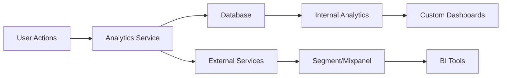

# Business Analytics

Grant includes comprehensive analytics capabilities to track user behavior, feature usage, and business metrics. This guide covers analytics implementation and best practices.

## Overview

Business analytics helps you understand:

- How users interact with your platform
- Which features are most valuable
- Where users encounter friction
- Growth and engagement trends



## Architecture

### Two-Tier Approach

1. **Internal Analytics**: PostgreSQL-based for compliance and core metrics
2. **External Analytics** (Optional): Third-party services for advanced features

**Benefits**:

- **Data ownership**: Keep sensitive data in your database
- **Compliance**: Meet GDPR/privacy requirements
- **Flexibility**: Use external services when beneficial
- **Cost control**: Internal analytics are free

## Configuration

### Environment Variables

```bash
# Enable analytics
ANALYTICS_ENABLED=true

# External analytics (optional)
ANALYTICS_EXTERNAL_ENABLED=false
ANALYTICS_PROVIDER=segment  # segment, mixpanel, posthog, none

# Segment configuration
SEGMENT_WRITE_KEY=your-segment-key

# Mixpanel configuration
MIXPANEL_TOKEN=your-mixpanel-token

# PostHog configuration
POSTHOG_API_KEY=your-posthog-key
POSTHOG_HOST=https://app.posthog.com
```

### Analytics Configuration

```typescript
// src/config/env.config.ts

export const ANALYTICS_CONFIG = {
  /** Enable analytics tracking */
  enabled: getEnvBoolean('ANALYTICS_ENABLED', true),

  /** Enable external analytics services */
  externalEnabled: getEnvBoolean('ANALYTICS_EXTERNAL_ENABLED', false),

  /** External analytics provider */
  provider: getEnvEnum(
    'ANALYTICS_PROVIDER',
    ['segment', 'mixpanel', 'posthog', 'none'] as const,
    'none'
  ),

  /** Segment configuration */
  segment: {
    writeKey: process.env.SEGMENT_WRITE_KEY || '',
  },

  /** Mixpanel configuration */
  mixpanel: {
    token: process.env.MIXPANEL_TOKEN || '',
  },

  /** PostHog configuration */
  posthog: {
    apiKey: process.env.POSTHOG_API_KEY || '',
    host: process.env.POSTHOG_HOST || 'https://app.posthog.com',
  },
} as const;
```

## Database Schema

### Analytics Events Table

```sql
-- Migration: Add analytics events table
CREATE TABLE analytics_events (
  id UUID PRIMARY KEY DEFAULT gen_random_uuid(),

  -- Event details
  event_name VARCHAR(100) NOT NULL,
  event_category VARCHAR(50),

  -- User context
  user_id UUID REFERENCES users(id) ON DELETE SET NULL,
  account_id UUID REFERENCES accounts(id) ON DELETE CASCADE,
  organization_id UUID REFERENCES organizations(id) ON DELETE SET NULL,

  -- Event properties (JSON)
  properties JSONB,

  -- Request context
  request_id UUID,
  ip_address INET,
  user_agent TEXT,

  -- Timestamps
  created_at TIMESTAMP WITH TIME ZONE DEFAULT CURRENT_TIMESTAMP NOT NULL,

  -- Indexes
  CONSTRAINT analytics_events_event_name_check CHECK (event_name <> '')
);

-- Indexes for common queries
CREATE INDEX idx_analytics_events_event_name ON analytics_events(event_name);
CREATE INDEX idx_analytics_events_user_id ON analytics_events(user_id);
CREATE INDEX idx_analytics_events_account_id ON analytics_events(account_id);
CREATE INDEX idx_analytics_events_created_at ON analytics_events(created_at);
CREATE INDEX idx_analytics_events_properties ON analytics_events USING gin(properties);

-- Composite index for common query pattern
CREATE INDEX idx_analytics_events_account_event_time
  ON analytics_events(account_id, event_name, created_at DESC);
```

### Drizzle Schema

```typescript
// packages/@grantjs/database/src/schema/analytics.schema.ts
import { pgTable, uuid, varchar, jsonb, timestamp, inet, text, index } from 'drizzle-orm/pg-core';
import { users } from './users.schema';
import { accounts } from './accounts.schema';
import { organizations } from './organizations.schema';

export const analyticsEvents = pgTable(
  'analytics_events',
  {
    id: uuid('id').primaryKey().defaultRandom(),

    // Event details
    eventName: varchar('event_name', { length: 100 }).notNull(),
    eventCategory: varchar('event_category', { length: 50 }),

    // User context
    userId: uuid('user_id').references(() => users.id, { onDelete: 'set null' }),
    accountId: uuid('account_id').references(() => accounts.id, { onDelete: 'cascade' }),
    organizationId: uuid('organization_id').references(() => organizations.id, {
      onDelete: 'set null',
    }),

    // Event properties
    properties: jsonb('properties'),

    // Request context
    requestId: uuid('request_id'),
    ipAddress: inet('ip_address'),
    userAgent: text('user_agent'),

    // Timestamp
    createdAt: timestamp('created_at').defaultNow().notNull(),
  },
  (table) => ({
    eventNameIdx: index('idx_analytics_events_event_name').on(table.eventName),
    userIdIdx: index('idx_analytics_events_user_id').on(table.userId),
    accountIdIdx: index('idx_analytics_events_account_id').on(table.accountId),
    createdAtIdx: index('idx_analytics_events_created_at').on(table.createdAt),
    propertiesIdx: index('idx_analytics_events_properties').on(table.properties),
    compositeIdx: index('idx_analytics_events_account_event_time').on(
      table.accountId,
      table.eventName,
      table.createdAt
    ),
  })
);
```

## Implementation

### Analytics Service

```typescript
// src/services/analytics.service.ts
import { eq, and, gte, lte, sql } from 'drizzle-orm';
import { DbSchema } from '@grantjs/database';
import { analyticsEvents } from '@grantjs/database/schema';
import { config } from '@/config';
import { logger } from '@/lib/logger';

export interface TrackEventInput {
  eventName: string;
  eventCategory?: string;
  userId?: string;
  accountId?: string;
  organizationId?: string;
  properties?: Record<string, any>;
  requestId?: string;
  ipAddress?: string;
  userAgent?: string;
}

export class AnalyticsService {
  constructor(private db: DbSchema) {}

  /**
   * Track an analytics event
   */
  async trackEvent(input: TrackEventInput): Promise<void> {
    if (!config.analytics.enabled) {
      return;
    }

    try {
      // Store in database
      await this.db.insert(analyticsEvents).values({
        eventName: input.eventName,
        eventCategory: input.eventCategory,
        userId: input.userId,
        accountId: input.accountId,
        organizationId: input.organizationId,
        properties: input.properties ? JSON.stringify(input.properties) : null,
        requestId: input.requestId,
        ipAddress: input.ipAddress,
        userAgent: input.userAgent,
        createdAt: new Date(),
      });

      // Send to external service (if configured)
      if (config.analytics.externalEnabled) {
        await this.sendToExternalService(input);
      }

      logger.debug({
        msg: 'Analytics event tracked',
        eventName: input.eventName,
        userId: input.userId,
      });
    } catch (error) {
      // Don't throw - analytics failures shouldn't break the app
      logger.error({
        msg: 'Failed to track analytics event',
        err: error,
        eventName: input.eventName,
      });
    }
  }

  /**
   * Send event to external analytics service
   */
  private async sendToExternalService(input: TrackEventInput): Promise<void> {
    try {
      switch (config.analytics.provider) {
        case 'segment':
          await this.sendToSegment(input);
          break;
        case 'mixpanel':
          await this.sendToMixpanel(input);
          break;
        case 'posthog':
          await this.sendToPostHog(input);
          break;
      }
    } catch (error) {
      logger.error({
        msg: 'Failed to send to external analytics',
        err: error,
        provider: config.analytics.provider,
      });
    }
  }

  /**
   * Get event counts
   */
  async getEventCounts(params: {
    accountId?: string;
    eventName?: string;
    startDate?: Date;
    endDate?: Date;
  }): Promise<{ eventName: string; count: number }[]> {
    const conditions = [];

    if (params.accountId) {
      conditions.push(eq(analyticsEvents.accountId, params.accountId));
    }
    if (params.eventName) {
      conditions.push(eq(analyticsEvents.eventName, params.eventName));
    }
    if (params.startDate) {
      conditions.push(gte(analyticsEvents.createdAt, params.startDate));
    }
    if (params.endDate) {
      conditions.push(lte(analyticsEvents.createdAt, params.endDate));
    }

    return this.db
      .select({
        eventName: analyticsEvents.eventName,
        count: sql<number>`count(*)::int`,
      })
      .from(analyticsEvents)
      .where(conditions.length > 0 ? and(...conditions) : undefined)
      .groupBy(analyticsEvents.eventName);
  }

  /**
   * Get daily event counts
   */
  async getDailyEventCounts(params: {
    accountId?: string;
    eventName?: string;
    days?: number;
  }): Promise<{ date: string; count: number }[]> {
    const startDate = new Date();
    startDate.setDate(startDate.getDate() - (params.days || 30));

    const conditions = [gte(analyticsEvents.createdAt, startDate)];

    if (params.accountId) {
      conditions.push(eq(analyticsEvents.accountId, params.accountId));
    }
    if (params.eventName) {
      conditions.push(eq(analyticsEvents.eventName, params.eventName));
    }

    return this.db
      .select({
        date: sql<string>`date(created_at)`,
        count: sql<number>`count(*)::int`,
      })
      .from(analyticsEvents)
      .where(and(...conditions))
      .groupBy(sql`date(created_at)`)
      .orderBy(sql`date(created_at)`);
  }
}
```

### Tracking Helper Functions

```typescript
// src/lib/analytics/tracking.ts
import { AnalyticsService } from '@/services/analytics.service';
import { Request } from 'express';

/**
 * Track event from request context
 */
export async function trackFromRequest(
  analyticsService: AnalyticsService,
  req: Request,
  eventName: string,
  properties?: Record<string, any>
): Promise<void> {
  await analyticsService.trackEvent({
    eventName,
    userId: (req as any).user?.id,
    accountId: (req as any).context?.accountId,
    organizationId: (req as any).context?.organizationId,
    properties,
    requestId: (req as any).requestId,
    ipAddress: req.ip,
    userAgent: req.headers['user-agent'],
  });
}

/**
 * Track user action
 */
export async function trackUserAction(
  analyticsService: AnalyticsService,
  action: string,
  userId: string,
  properties?: Record<string, any>
): Promise<void> {
  await analyticsService.trackEvent({
    eventName: `user.${action}`,
    eventCategory: 'user',
    userId,
    properties,
  });
}

/**
 * Track feature usage
 */
export async function trackFeatureUsage(
  analyticsService: AnalyticsService,
  featureName: string,
  userId: string,
  accountId: string,
  properties?: Record<string, any>
): Promise<void> {
  await analyticsService.trackEvent({
    eventName: `feature.${featureName}`,
    eventCategory: 'feature',
    userId,
    accountId,
    properties,
  });
}
```

## Standard Events

### User Events

```typescript
// User lifecycle
await analyticsService.trackEvent({
  eventName: 'user.signup',
  userId: user.id,
  accountId: account.id,
  properties: { method: 'email', plan: 'free' },
});

await analyticsService.trackEvent({
  eventName: 'user.login',
  userId: user.id,
  properties: { method: 'password' },
});

await analyticsService.trackEvent({
  eventName: 'user.logout',
  userId: user.id,
});
```

### Organization Events

```typescript
// Organization management
await analyticsService.trackEvent({
  eventName: 'organization.created',
  userId: user.id,
  accountId: account.id,
  organizationId: organization.id,
  properties: { name: organization.name },
});

await analyticsService.trackEvent({
  eventName: 'organization.member.invited',
  userId: user.id,
  organizationId: organization.id,
  properties: { email: invite.email, role: invite.role },
});
```

### Permission Events

```typescript
// Permission changes
await analyticsService.trackEvent({
  eventName: 'permission.granted',
  userId: user.id,
  accountId: account.id,
  properties: {
    resourceType: 'project',
    resourceId: project.id,
    action: 'read',
    grantedTo: grantee.id,
  },
});
```

### Feature Usage Events

```typescript
// Feature tracking
await analyticsService.trackEvent({
  eventName: 'feature.advanced_permissions.used',
  eventCategory: 'feature',
  userId: user.id,
  accountId: account.id,
  properties: { context: 'project_settings' },
});
```

## Usage in Controllers

### Track in REST Controllers

```typescript
// src/rest/controllers/organizations.controller.ts
import { trackFromRequest } from '@/lib/analytics/tracking';

export class OrganizationsController {
  async create(req: Request, res: Response) {
    const organization = await this.service.createOrganization(req.body);

    // Track event
    await trackFromRequest(this.analyticsService, req, 'organization.created', {
      organizationId: organization.id,
      name: organization.name,
    });

    res.json(organization);
  }
}
```

### Track in GraphQL Resolvers

```typescript
// src/graphql/resolvers/organization.resolver.ts
export const organizationResolvers = {
  Mutation: {
    createOrganization: async (_, { input }, context) => {
      const organization = await context.services.organizations.create(input);

      // Track event
      await context.services.analytics.trackEvent({
        eventName: 'organization.created',
        userId: context.user.id,
        accountId: context.accountId,
        organizationId: organization.id,
        properties: { name: organization.name },
      });

      return organization;
    },
  },
};
```

## Querying Analytics

### Event Counts

```typescript
// Get total events by type
const eventCounts = await analyticsService.getEventCounts({
  accountId: 'account-123',
  startDate: new Date('2024-01-01'),
  endDate: new Date('2024-12-31'),
});
```

### Daily Active Users

```sql
-- Daily active users
SELECT
  date(created_at) as date,
  COUNT(DISTINCT user_id) as active_users
FROM analytics_events
WHERE event_name = 'user.login'
  AND created_at >= NOW() - INTERVAL '30 days'
GROUP BY date(created_at)
ORDER BY date DESC;
```

### Feature Adoption

```sql
-- Feature adoption by account
SELECT
  account_id,
  COUNT(DISTINCT user_id) as unique_users,
  COUNT(*) as total_uses
FROM analytics_events
WHERE event_name LIKE 'feature.%'
  AND created_at >= NOW() - INTERVAL '7 days'
GROUP BY account_id
ORDER BY total_uses DESC;
```

### User Funnel

```sql
-- Signup to first organization created
WITH signups AS (
  SELECT user_id, MIN(created_at) as signup_at
  FROM analytics_events
  WHERE event_name = 'user.signup'
  GROUP BY user_id
),
orgs AS (
  SELECT user_id, MIN(created_at) as org_created_at
  FROM analytics_events
  WHERE event_name = 'organization.created'
  GROUP BY user_id
)
SELECT
  COUNT(DISTINCT s.user_id) as total_signups,
  COUNT(DISTINCT o.user_id) as created_org,
  ROUND(COUNT(DISTINCT o.user_id)::numeric / COUNT(DISTINCT s.user_id) * 100, 2) as conversion_rate
FROM signups s
LEFT JOIN orgs o ON s.user_id = o.user_id;
```

## External Services Integration

### Segment

```typescript
// src/lib/analytics/adapters/segment.adapter.ts
import Analytics from '@segment/analytics-node';
import { config } from '@/config';
import { TrackEventInput } from '@/services/analytics.service';

export class SegmentAdapter {
  private client: Analytics;

  constructor() {
    this.client = new Analytics({ writeKey: config.analytics.segment.writeKey });
  }

  async track(event: TrackEventInput): Promise<void> {
    await this.client.track({
      userId: event.userId,
      event: event.eventName,
      properties: event.properties,
      context: {
        ip: event.ipAddress,
        userAgent: event.userAgent,
      },
    });
  }

  async identify(userId: string, traits: Record<string, any>): Promise<void> {
    await this.client.identify({
      userId,
      traits,
    });
  }
}
```

### PostHog

```typescript
// src/lib/analytics/adapters/posthog.adapter.ts
import { PostHog } from 'posthog-node';
import { config } from '@/config';
import { TrackEventInput } from '@/services/analytics.service';

export class PostHogAdapter {
  private client: PostHog;

  constructor() {
    this.client = new PostHog(config.analytics.posthog.apiKey, {
      host: config.analytics.posthog.host,
    });
  }

  async track(event: TrackEventInput): Promise<void> {
    this.client.capture({
      distinctId: event.userId || 'anonymous',
      event: event.eventName,
      properties: event.properties,
    });
  }
}
```

## Privacy & Compliance

### GDPR Compliance

```typescript
/**
 * Delete user analytics data (GDPR right to be forgotten)
 */
async deleteUserData(userId: string): Promise<void> {
  await this.db
    .delete(analyticsEvents)
    .where(eq(analyticsEvents.userId, userId));
}

/**
 * Export user analytics data (GDPR right to data portability)
 */
async exportUserData(userId: string): Promise<any[]> {
  return this.db
    .select()
    .from(analyticsEvents)
    .where(eq(analyticsEvents.userId, userId))
    .orderBy(analyticsEvents.createdAt);
}
```

### PII Protection

Don't track sensitive data:

```typescript
// ❌ Bad: Tracking PII
await analyticsService.trackEvent({
  eventName: 'user.updated',
  properties: {
    email: user.email, // ← Don't track email
    password: user.password, // ← Never track passwords!
  },
});

// ✅ Good: Track only necessary data
await analyticsService.trackEvent({
  eventName: 'user.updated',
  properties: {
    fieldsUpdated: ['email', 'name'],
  },
});
```

## Data Retention

### Automated Cleanup

```typescript
/**
 * Delete old analytics events
 */
async cleanupOldEvents(retentionDays: number = 365): Promise<void> {
  const cutoffDate = new Date();
  cutoffDate.setDate(cutoffDate.getDate() - retentionDays);

  await this.db
    .delete(analyticsEvents)
    .where(lte(analyticsEvents.createdAt, cutoffDate));

  logger.info({
    msg: 'Cleaned up old analytics events',
    cutoffDate,
  });
}
```

### Scheduled Cleanup

```typescript
// Run daily cleanup via cron job
import { CronJob } from 'cron';

const cleanupJob = new CronJob('0 2 * * *', async () => {
  await analyticsService.cleanupOldEvents(365);
});

cleanupJob.start();
```

## Best Practices

### 1. Track User Intent, Not Just Actions

```typescript
// ❌ Just tracking clicks
trackEvent('button.clicked', { buttonId: 'submit' });

// ✅ Tracking user intent
trackEvent('organization.create.attempted', {
  source: 'dashboard',
  hasFilledAllFields: true,
});
```

### 2. Use Consistent Event Naming

```typescript
// Use format: <entity>.<action>[.<detail>]
'user.signup';
'user.login';
'organization.created';
'organization.member.invited';
'permission.granted';
'feature.advanced_permissions.used';
```

### 3. Don't Block on Analytics

```typescript
// ❌ Bad: Waiting for analytics
await analyticsService.trackEvent(...);
return response;

// ✅ Good: Fire and forget
analyticsService.trackEvent(...).catch(err => logger.error(err));
return response;
```

### 4. Aggregate Before Querying

Use materialized views for expensive queries:

```sql
-- Create materialized view for daily stats
CREATE MATERIALIZED VIEW daily_user_stats AS
SELECT
  date(created_at) as date,
  account_id,
  COUNT(DISTINCT user_id) as active_users,
  COUNT(*) as total_events
FROM analytics_events
GROUP BY date(created_at), account_id;

-- Refresh daily
REFRESH MATERIALIZED VIEW daily_user_stats;
```

## Next Steps

- **Review observability overview**: [Observability Overview](/advanced-topics/observability-overview)
- **Set up dashboards**: Create analytics dashboards
- **Configure retention**: Set data retention policies
- **Export data**: Integrate with BI tools

## Resources

- [Segment Documentation](https://segment.com/docs/)
- [PostHog Documentation](https://posthog.com/docs)
- [Mixpanel Documentation](https://developer.mixpanel.com/docs)
- [GDPR Compliance Guide](https://gdpr.eu/)

---

**Ready to implement?** Start with [Logging](/advanced-topics/logging) →
