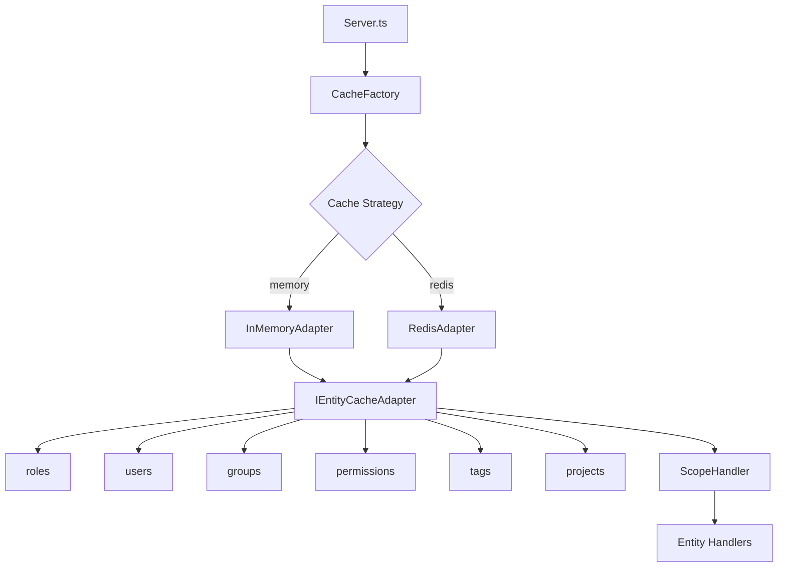

# Caching System

Grant features a flexible, strategy-based caching system that supports both **in-memory** and **Redis** backends, enabling seamless scaling from single-instance development to distributed production deployments.

## Overview

The caching system follows the **Adapter Pattern**, providing a consistent interface while allowing you to swap cache backends via configuration. This architecture ensures optimal performance across different deployment scenarios.

## Architecture



## Features

- **🔄 Strategy Pattern**: Swap cache backends via configuration
- **⚡ Async API**: All operations are promise-based for consistency
- **🔒 Type-Safe**: Full TypeScript support with comprehensive interfaces
- **🎯 Entity Namespacing**: Separate cache spaces for each entity type
- **🔌 Graceful Shutdown**: Proper cleanup and connection handling
- **📊 Multi-Tenant Support**: Cache keys scoped by tenant and entity ID

## Configuration

Set environment variables to control cache behavior:

```bash
# Cache strategy: 'memory' (default) or 'redis'
CACHE_STRATEGY=redis

# Redis connection (only needed when CACHE_STRATEGY=redis)
REDIS_HOST=localhost
REDIS_PORT=6379
REDIS_PASSWORD=your_redis_password
```

## Cache Strategies

### In-Memory Cache

Best for **development** and **single-instance** deployments.

```typescript
import { CacheFactory } from '@/lib/cache';

const cache = CacheFactory.createEntityCache({
  strategy: 'memory',
});
```

**Advantages:**

- ⚡ Fast (no network overhead)
- 🛠️ Simple setup (no external dependencies)
- 💻 Perfect for local development

**Limitations:**

- ❌ Not suitable for multi-instance deployments
- ❌ Data lost on application restart
- ❌ No cross-process sharing

### Redis Cache

Best for **production** and **multi-instance** deployments.

```typescript
import { CacheFactory } from '@/lib/cache';

const cache = CacheFactory.createEntityCache({
  strategy: 'redis',
  redis: {
    host: 'localhost',
    port: 6379,
    password: 'your_password',
  },
});
```

**Advantages:**

- 🌐 Distributed caching across multiple instances
- 💾 Persistent (survives application restarts)
- 🔄 Shared state across all app nodes
- 📈 Scales horizontally

**Considerations:**

- 🌍 Network latency (minimal)
- 🐳 Requires Redis server
- 🏗️ Additional infrastructure

## API Reference

### ICacheAdapter Interface

Core interface implemented by all cache adapters:

```typescript
interface ICacheAdapter {
  // Get cached value
  get(key: CacheKey): Promise<Set<string> | null>;

  // Set cache value
  set(key: CacheKey, value: Set<string>): Promise<void>;

  // Check if key exists
  has(key: CacheKey): Promise<boolean>;

  // Delete specific key
  delete(key: CacheKey): Promise<void>;

  // Clear all entries
  clear(): Promise<void>;

  // Get keys matching pattern
  keys(pattern?: string): Promise<CacheKey[]>;

  // Cleanup connection
  disconnect(): Promise<void>;
}
```

### IEntityCacheAdapter Interface

Entity-specific cache structure used throughout the application:

```typescript
interface IEntityCacheAdapter {
  roles: ICacheAdapter;
  users: ICacheAdapter;
  groups: ICacheAdapter;
  permissions: ICacheAdapter;
  tags: ICacheAdapter;
  projects: ICacheAdapter;
}
```

## Cache Keys

### Key Format

Cache keys follow a consistent pattern:

```
{tenant}:{id}
```

**Examples:**

- `organization:550e8400-e29b-41d4-a716-446655440000`
- `project:6ba7b810-9dad-11d1-80b4-00c04fd430c8`
- `account:3f2504e0-4f89-11d3-9a0c-0305e82c3301`

### Redis Key Prefixes

When using Redis, keys are automatically prefixed by entity type to prevent collisions:

```
grant:{entity_type}:{tenant}:{id}
```

**Examples:**

- `grant:roles:organization:550e8400-e29b-41d4-a716-446655440000`
- `grant:users:project:6ba7b810-9dad-11d1-80b4-00c04fd430c8`
- `grant:tags:account:3f2504e0-4f89-11d3-9a0c-0305e82c3301`

This namespacing enables efficient pattern-based operations and prevents key collisions.

## Cache Expiration

Redis entries expire after **24 hours** by default to prevent stale data accumulation. This TTL (time-to-live) can be adjusted based on your application's needs.

## Docker Setup

### Adding Redis to Docker Compose

Add the Redis service to your `docker-compose.yml`:

```yaml
services:
  redis:
    image: redis:7-alpine
    container_name: grant-redis
    command: redis-server --requirepass grant_redis_password
    ports:
      - '6379:6379'
    volumes:
      - redis_data:/data
    healthcheck:
      test: ['CMD', 'redis-cli', '--raw', 'incr', 'ping']
      interval: 10s
      timeout: 3s
      retries: 5
    restart: unless-stopped
    networks:
      - grant-network

volumes:
  redis_data:

networks:
  grant-network:
    driver: bridge
```

### Starting Redis

```bash
# Start Redis container
docker-compose up redis -d

# Verify Redis is running
docker ps | grep redis

# Check Redis logs
docker logs grant-redis

# Connect to Redis CLI
docker exec -it grant-redis redis-cli -a grant_redis_password
```

## Usage Examples

### Basic Operations

```typescript
// Get scoped role IDs from cache
const roleIds = await scopeCache.roles.get('organization:123');

// Set scoped role IDs in cache
await scopeCache.roles.set('organization:123', new Set(['role-1', 'role-2']));

// Check if cache entry exists
const exists = await scopeCache.roles.has('organization:123');

// Remove specific entry
await scopeCache.roles.delete('organization:123');

// Clear all role cache entries
await scopeCache.roles.clear();
```

### Programmatic Usage

```typescript
import { CacheFactory } from '@/lib/cache';

// Create cache instance
const cache = CacheFactory.createEntityCache({
  strategy: process.env.CACHE_STRATEGY || 'memory',
  redis:
    process.env.CACHE_STRATEGY === 'redis'
      ? {
          host: process.env.REDIS_HOST || 'localhost',
          port: Number(process.env.REDIS_PORT) || 6379,
          password: process.env.REDIS_PASSWORD,
        }
      : undefined,
});

// Use in your application
await cache.users.set('project:abc', new Set(['user-1', 'user-2']));
const users = await cache.users.get('project:abc');

// Cleanup on shutdown
await CacheFactory.disconnect(cache);
```

## Extending the Cache System

The cache system is designed to be extensible. You can add new cache adapters for other backends (e.g., Memcached, Valkey).

### Adding a New Adapter

1. **Create the Adapter Class**

```typescript
// adapters/memcached-cache.adapter.ts
import { ICacheAdapter } from '@/lib/cache';

export class MemcachedAdapter implements ICacheAdapter {
  private client: MemcachedClient;

  constructor(config: { host: string; port: number }) {
    this.client = new MemcachedClient(config);
  }

  async get(key: CacheKey): Promise<Set<string> | null> {
    // Implementation
  }

  async set(key: CacheKey, value: Set<string>): Promise<void> {
    // Implementation
  }

  // ... other methods
}
```

2. **Update the Factory**

```typescript
// cache.factory.ts
case 'memcached':
  return new MemcachedAdapter({
    host: config.memcached.host,
    port: config.memcached.port,
  });
```

3. **Add Configuration**

```typescript
// config/constants.config.ts
export const MEMCACHED_HOST = process.env.MEMCACHED_HOST || 'localhost';
export const MEMCACHED_PORT = Number(process.env.MEMCACHED_PORT) || 11211;
```

## Testing

### Unit Tests

```typescript
import { describe, it, expect } from 'vitest';
import { CacheFactory } from '@/lib/cache';

describe('CacheSystem', () => {
  it('should store and retrieve values', async () => {
    const cache = CacheFactory.createEntityCache({ strategy: 'memory' });

    await cache.roles.set('organization:test', new Set(['role-1', 'role-2']));
    const roles = await cache.roles.get('organization:test');

    expect(roles).toEqual(new Set(['role-1', 'role-2']));

    await CacheFactory.disconnect(cache);
  });

  it('should handle cache misses', async () => {
    const cache = CacheFactory.createEntityCache({ strategy: 'memory' });

    const result = await cache.roles.get('organization:nonexistent');

    expect(result).toBeNull();

    await CacheFactory.disconnect(cache);
  });
});
```

### Integration Tests with Redis

```bash
# Start Redis for testing
docker-compose up redis -d

# Run tests with Redis strategy
CACHE_STRATEGY=redis REDIS_PASSWORD=grant_redis_password npm test
```

## Troubleshooting

### Redis Connection Errors

**Problem:**

```
Redis Client Error: connect ECONNREFUSED
```

**Solutions:**

```bash
# Check if Redis is running
docker ps | grep redis

# Start Redis if not running
docker-compose up redis -d

# Check Redis logs
docker logs grant-redis

# Verify Redis connection
docker exec -it grant-redis redis-cli -a grant_redis_password ping
# Should return: PONG
```

### Authentication Errors

**Problem:**

```
NOAUTH Authentication required
```

**Solution:**

Ensure the `REDIS_PASSWORD` environment variable matches your Redis configuration:

```bash
export REDIS_PASSWORD=grant_redis_password
```

### Memory Cache Growing Too Large

**Problem:** Application memory usage increasing over time.

**Solutions:**

- Switch to Redis cache strategy
- Implement cache size limits
- Add custom TTL (time-to-live) logic
- Monitor cache statistics

### Stale Cache Data

**Problem:** Cache contains outdated information.

**Solution:** Cache entries are automatically updated when entities are created/deleted. If you modify data directly in the database, manually clear the cache:

```typescript
// Clear all entries for a specific entity type
await cache.roles.clear();

// Clear specific entry
await cache.roles.delete('organization:123');

// Reconnect to force refresh
await CacheFactory.disconnect(cache);
const newCache = CacheFactory.createEntityCache({
  strategy: 'redis',
  redis: { ... }
});
```

## Performance Considerations

### In-Memory Cache

- **Latency**: ~1-2ms (local memory access)
- **Throughput**: 100,000+ ops/second
- **Best for**: Single instance, low-latency requirements

### Redis Cache

- **Latency**: ~5-10ms (network + Redis processing)
- **Throughput**: 10,000-50,000 ops/second (depending on network)
- **Best for**: Distributed systems, persistence requirements

### Optimization Tips

1. **Batch Operations**: Group cache operations when possible
2. **Connection Pooling**: Redis adapter uses connection pooling automatically
3. **Key Design**: Use consistent, predictable key patterns
4. **Monitoring**: Track cache hit/miss rates to optimize TTL
5. **Namespace Strategy**: Leverage entity-specific namespaces for efficient clearing

## Production Deployment

### Environment Variables

```bash
# .env.production
CACHE_STRATEGY=redis
REDIS_HOST=redis.production.example.com
REDIS_PORT=6379
REDIS_PASSWORD=your_secure_password
```

### High Availability Setup

For production, consider:

- **Redis Sentinel** for automatic failover
- **Redis Cluster** for horizontal scaling
- **AWS ElastiCache** for managed Redis
- **Azure Cache for Redis** for Azure deployments

### Monitoring

Monitor these metrics:

- Cache hit rate (target: >80%)
- Cache size (memory usage)
- Connection pool utilization
- Response times
- Error rates

## Best Practices

1. ✅ **Use Redis in Production**: For multi-instance deployments
2. ✅ **Configure TTL**: Set appropriate expiration times
3. ✅ **Monitor Performance**: Track cache hit rates and latency
4. ✅ **Handle Failures Gracefully**: Application should work even if cache fails
5. ✅ **Namespace Properly**: Use entity-specific prefixes
6. ✅ **Clear on Updates**: Invalidate cache when data changes
7. ✅ **Test Both Strategies**: Ensure code works with memory and Redis
8. ✅ **Document Keys**: Maintain clear key naming conventions

## Related Topics

- [Performance Optimization](/advanced-topics/performance)
- [Transaction Management](/advanced-topics/transactions)
- [Multi-Tenancy](/architecture/multi-tenancy)
- [Deployment Guide](/deployment/self-hosting)
