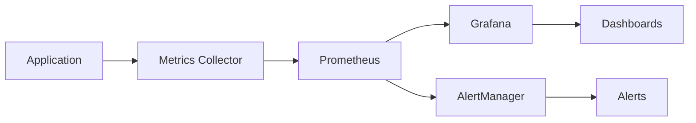

# Metrics & Monitoring

Grant uses [Prometheus](https://prometheus.io/) for metrics collection and monitoring. This guide covers metrics setup, custom metrics, and monitoring best practices.

## What are Metrics?

Metrics are numerical measurements collected over time that help you understand system behavior and performance:



### Types of Metrics

**Prometheus provides four metric types:**

1. **Counter**: Monotonically increasing value (e.g., total requests)
2. **Gauge**: Value that can go up or down (e.g., active connections)
3. **Histogram**: Observations grouped into buckets (e.g., request duration)
4. **Summary**: Similar to histogram but with quantiles

## Why Prometheus?

- **Pull-based**: Prometheus scrapes metrics from your application
- **Time-series**: Built for time-series data with powerful queries
- **Multi-dimensional**: Label-based data model for flexible querying
- **Alerting**: Built-in alert manager with powerful rules
- **Industry standard**: De facto standard for metrics in cloud-native apps

## Installation

Install Prometheus client library:

```bash
cd apps/api
pnpm add prom-client
```

## Configuration

### Environment Variables

Add to your `.env` file:

```bash
# Enable metrics
METRICS_ENABLED=true

# Metrics endpoint
METRICS_ENDPOINT=/metrics

# Default labels
METRICS_DEFAULT_LABELS={"environment":"production","service":"grant-api"}
```

### Metrics Configuration

```typescript
// src/config/env.config.ts

export const METRICS_CONFIG = {
  /** Enable metrics collection */
  enabled: getEnvBoolean('METRICS_ENABLED', true),

  /** Metrics endpoint path */
  endpoint: getEnv('METRICS_ENDPOINT', '/metrics'),

  /** Collect default metrics (CPU, memory, etc.) */
  collectDefaults: getEnvBoolean('METRICS_COLLECT_DEFAULTS', true),

  /** Default metric labels */
  defaultLabels: {
    environment: APP_CONFIG.nodeEnv,
    service: 'grant-api',
    version: APP_CONFIG.version,
  },
} as const;
```

## Implementation

### Metrics Module

Create the metrics module:

```typescript
// src/lib/metrics/metrics.ts
import promClient from 'prom-client';
import { Request, Response } from 'express';
import { config } from '@/config';

/**
 * Create and configure Prometheus registry
 */
export const register = new promClient.Registry();

// Set default labels
register.setDefaultLabels(config.metrics.defaultLabels);

// Collect default metrics (CPU, memory, event loop, etc.)
if (config.metrics.collectDefaults) {
  promClient.collectDefaultMetrics({ register });
}

// ============================================================================
// HTTP Metrics
// ============================================================================

/**
 * HTTP request duration histogram
 * Tracks how long requests take to complete
 */
export const httpRequestDuration = new promClient.Histogram({
  name: 'http_request_duration_seconds',
  help: 'Duration of HTTP requests in seconds',
  labelNames: ['method', 'route', 'status_code', 'account_id'],
  buckets: [0.001, 0.005, 0.015, 0.05, 0.1, 0.5, 1, 5, 10],
  registers: [register],
});

/**
 * HTTP request counter
 * Tracks total number of requests
 */
export const httpRequestTotal = new promClient.Counter({
  name: 'http_requests_total',
  help: 'Total number of HTTP requests',
  labelNames: ['method', 'route', 'status_code', 'account_id'],
  registers: [register],
});

/**
 * HTTP request size histogram
 */
export const httpRequestSize = new promClient.Histogram({
  name: 'http_request_size_bytes',
  help: 'Size of HTTP requests in bytes',
  labelNames: ['method', 'route'],
  buckets: [100, 1000, 10000, 100000, 1000000],
  registers: [register],
});

/**
 * HTTP response size histogram
 */
export const httpResponseSize = new promClient.Histogram({
  name: 'http_response_size_bytes',
  help: 'Size of HTTP responses in bytes',
  labelNames: ['method', 'route', 'status_code'],
  buckets: [100, 1000, 10000, 100000, 1000000],
  registers: [register],
});

// ============================================================================
// GraphQL Metrics
// ============================================================================

/**
 * GraphQL operation duration histogram
 */
export const graphqlOperationDuration = new promClient.Histogram({
  name: 'graphql_operation_duration_seconds',
  help: 'Duration of GraphQL operations in seconds',
  labelNames: ['operation_type', 'operation_name', 'success'],
  buckets: [0.001, 0.005, 0.015, 0.05, 0.1, 0.5, 1, 5],
  registers: [register],
});

/**
 * GraphQL operation counter
 */
export const graphqlOperationTotal = new promClient.Counter({
  name: 'graphql_operations_total',
  help: 'Total number of GraphQL operations',
  labelNames: ['operation_type', 'operation_name', 'success'],
  registers: [register],
});

/**
 * GraphQL resolver duration histogram
 */
export const graphqlResolverDuration = new promClient.Histogram({
  name: 'graphql_resolver_duration_seconds',
  help: 'Duration of GraphQL resolvers in seconds',
  labelNames: ['parent_type', 'field_name'],
  buckets: [0.001, 0.005, 0.015, 0.05, 0.1, 0.5, 1],
  registers: [register],
});

// ============================================================================
// Database Metrics
// ============================================================================

/**
 * Database query duration histogram
 */
export const databaseQueryDuration = new promClient.Histogram({
  name: 'database_query_duration_seconds',
  help: 'Duration of database queries in seconds',
  labelNames: ['operation', 'table'],
  buckets: [0.001, 0.005, 0.01, 0.05, 0.1, 0.5, 1, 5],
  registers: [register],
});

/**
 * Database connection pool gauge
 */
export const databaseConnectionsActive = new promClient.Gauge({
  name: 'database_connections_active',
  help: 'Number of active database connections',
  registers: [register],
});

export const databaseConnectionsIdle = new promClient.Gauge({
  name: 'database_connections_idle',
  help: 'Number of idle database connections',
  registers: [register],
});

export const databaseConnectionsTotal = new promClient.Gauge({
  name: 'database_connections_total',
  help: 'Total number of database connections',
  registers: [register],
});

// ============================================================================
// Cache Metrics
// ============================================================================

/**
 * Cache operations counter
 */
export const cacheOperations = new promClient.Counter({
  name: 'cache_operations_total',
  help: 'Total number of cache operations',
  labelNames: ['operation', 'cache_type', 'result'],
  registers: [register],
});

/**
 * Cache hit ratio gauge
 */
export const cacheHitRatio = new promClient.Gauge({
  name: 'cache_hit_ratio',
  help: 'Cache hit ratio (0-1)',
  labelNames: ['cache_type'],
  registers: [register],
});

// ============================================================================
// Authentication Metrics
// ============================================================================

/**
 * Authentication attempts counter
 */
export const authenticationAttempts = new promClient.Counter({
  name: 'authentication_attempts_total',
  help: 'Total authentication attempts',
  labelNames: ['method', 'result'],
  registers: [register],
});

/**
 * Active sessions gauge
 */
export const activeSessions = new promClient.Gauge({
  name: 'active_sessions',
  help: 'Number of active user sessions',
  registers: [register],
});

// ============================================================================
// Authorization Metrics
// ============================================================================

/**
 * Permission checks counter
 */
export const permissionChecks = new promClient.Counter({
  name: 'permission_checks_total',
  help: 'Total permission checks',
  labelNames: ['action', 'resource', 'result'],
  registers: [register],
});

// ============================================================================
// Business Metrics
// ============================================================================

/**
 * Active tenants gauge
 */
export const activeTenants = new promClient.Gauge({
  name: 'active_tenants',
  help: 'Number of active tenants',
  registers: [register],
});

/**
 * API rate limit counter
 */
export const rateLimitExceeded = new promClient.Counter({
  name: 'rate_limit_exceeded_total',
  help: 'Total number of rate limit violations',
  labelNames: ['account_id', 'endpoint'],
  registers: [register],
});

// ============================================================================
// Middleware
// ============================================================================

/**
 * Metrics middleware for HTTP requests
 */
export function metricsMiddleware(req: Request, res: Response, next: any) {
  if (!config.metrics.enabled) {
    return next();
  }

  const startTime = Date.now();
  const route = req.route?.path || req.path;

  // Track request size
  const requestSize = parseInt(req.headers['content-length'] || '0', 10);
  if (requestSize > 0) {
    httpRequestSize.observe({ method: req.method, route }, requestSize);
  }

  // Track response when finished
  res.on('finish', () => {
    const duration = (Date.now() - startTime) / 1000;
    const accountId = (req as any).context?.accountId || 'anonymous';

    // Track duration
    httpRequestDuration.observe(
      {
        method: req.method,
        route,
        status_code: res.statusCode,
        account_id: accountId,
      },
      duration
    );

    // Track total requests
    httpRequestTotal.inc({
      method: req.method,
      route,
      status_code: res.statusCode,
      account_id: accountId,
    });

    // Track response size
    const responseSize = parseInt((res.getHeader('content-length') as string) || '0', 10);
    if (responseSize > 0) {
      httpResponseSize.observe(
        { method: req.method, route, status_code: res.statusCode },
        responseSize
      );
    }
  });

  next();
}

/**
 * Metrics endpoint handler
 */
export async function metricsHandler(req: Request, res: Response) {
  try {
    res.set('Content-Type', register.contentType);
    const metrics = await register.metrics();
    res.send(metrics);
  } catch (error) {
    res.status(500).send('Error collecting metrics');
  }
}
```

### Integration in Server

Add metrics to your server:

```typescript
// src/server.ts
import { metricsMiddleware, metricsHandler } from '@/lib/metrics';

async function startServer() {
  const app = express();

  // ... other middleware

  // Add metrics middleware (before routes)
  if (config.metrics.enabled) {
    app.use(metricsMiddleware);
  }

  // ... your routes

  // Metrics endpoint
  if (config.metrics.enabled) {
    app.get(config.metrics.endpoint, metricsHandler);
  }

  // ... rest of setup
}
```

## Custom Metrics

### Creating Custom Metrics

Add business-specific metrics:

```typescript
// src/lib/metrics/business-metrics.ts
import promClient from 'prom-client';
import { register } from './metrics';

/**
 * Organization creation counter
 */
export const organizationsCreated = new promClient.Counter({
  name: 'organizations_created_total',
  help: 'Total number of organizations created',
  labelNames: ['account_id', 'plan_type'],
  registers: [register],
});

/**
 * User invitations counter
 */
export const userInvitations = new promClient.Counter({
  name: 'user_invitations_total',
  help: 'Total number of user invitations sent',
  labelNames: ['organization_id', 'status'],
  registers: [register],
});

/**
 * Active users gauge
 */
export const activeUsers = new promClient.Gauge({
  name: 'active_users',
  help: 'Number of active users in the last 24 hours',
  labelNames: ['account_id'],
  registers: [register],
});
```

### Using Custom Metrics

```typescript
import { organizationsCreated, activeUsers } from '@/lib/metrics/business-metrics';

export class OrganizationService {
  async createOrganization(data: CreateOrganizationInput) {
    const organization = await this.repository.create(data);

    // Track metric
    organizationsCreated.inc({
      account_id: data.accountId,
      plan_type: data.planType || 'free',
    });

    return organization;
  }
}
```

## Querying Metrics

### Metrics Endpoint

Access metrics at your configured endpoint:

```bash
curl http://localhost:4000/metrics
```

Output:

```prometheus
# HELP http_requests_total Total number of HTTP requests
# TYPE http_requests_total counter
http_requests_total{method="GET",route="/api/organizations",status_code="200",account_id="acc-123"} 145

# HELP http_request_duration_seconds Duration of HTTP requests in seconds
# TYPE http_request_duration_seconds histogram
http_request_duration_seconds_bucket{method="GET",route="/api/organizations",status_code="200",account_id="acc-123",le="0.005"} 10
http_request_duration_seconds_bucket{method="GET",route="/api/organizations",status_code="200",account_id="acc-123",le="0.05"} 120
```

### Prometheus Queries (PromQL)

**Request rate** (requests per second):

```promql
rate(http_requests_total[5m])
```

**Error rate** (percentage):

```promql
sum(rate(http_requests_total{status_code=~"5.."}[5m])) /
sum(rate(http_requests_total[5m])) * 100
```

**95th percentile latency**:

```promql
histogram_quantile(0.95,
  sum(rate(http_request_duration_seconds_bucket[5m])) by (le)
)
```

**Database connections**:

```promql
database_connections_active
```

**Cache hit rate**:

```promql
sum(rate(cache_operations_total{result="hit"}[5m])) /
sum(rate(cache_operations_total[5m]))
```

## Prometheus Setup

### Docker Compose

Add Prometheus to your stack:

```yaml
# docker-compose.yml
version: '3.8'

services:
  api:
    build: ./apps/api
    ports:
      - '4000:4000'
    environment:
      METRICS_ENABLED: 'true'

  prometheus:
    image: prom/prometheus:latest
    ports:
      - '9090:9090'
    volumes:
      - ./prometheus.yml:/etc/prometheus/prometheus.yml
      - prometheus_data:/prometheus
    command:
      - '--config.file=/etc/prometheus/prometheus.yml'
      - '--storage.tsdb.path=/prometheus'

  grafana:
    image: grafana/grafana:latest
    ports:
      - '3001:3000'
    volumes:
      - grafana_data:/var/lib/grafana
    environment:
      - GF_SECURITY_ADMIN_PASSWORD=admin

volumes:
  prometheus_data:
  grafana_data:
```

### Prometheus Configuration

```yaml
# prometheus.yml
global:
  scrape_interval: 15s
  evaluation_interval: 15s

scrape_configs:
  - job_name: 'grant-api'
    static_configs:
      - targets: ['api:4000']
    metrics_path: '/metrics'
    scrape_interval: 10s
```

### Start Services

```bash
docker-compose up -d prometheus grafana

# Access Prometheus at http://localhost:9090
# Access Grafana at http://localhost:3001
```

## Grafana Dashboards

### Add Prometheus Data Source

1. Open Grafana at `http://localhost:3001`
2. Login (admin/admin)
3. Configuration → Data Sources → Add data source
4. Select Prometheus
5. URL: `http://prometheus:9090`
6. Save & Test

### Create Dashboard

Example dashboard panels:

**Request Rate Panel**:

```promql
sum(rate(http_requests_total[5m])) by (method)
```

**Error Rate Panel**:

```promql
sum(rate(http_requests_total{status_code=~"5.."}[5m])) /
sum(rate(http_requests_total[5m])) * 100
```

**Latency Heatmap**:

```promql
sum(rate(http_request_duration_seconds_bucket[5m])) by (le)
```

**Database Connections**:

```promql
database_connections_active
database_connections_idle
database_connections_total
```

## Alerting

### Alert Rules

Create alert rules in Prometheus:

```yaml
# alerts.yml
groups:
  - name: grant-api-alerts
    interval: 30s
    rules:
      # High error rate
      - alert: HighErrorRate
        expr: |
          sum(rate(http_requests_total{status_code=~"5.."}[5m])) /
          sum(rate(http_requests_total[5m])) > 0.05
        for: 5m
        labels:
          severity: critical
        annotations:
          summary: 'High error rate detected'
          description: 'Error rate is {{ $value | humanizePercentage }}'

      # High latency
      - alert: HighLatency
        expr: |
          histogram_quantile(0.95, 
            sum(rate(http_request_duration_seconds_bucket[5m])) by (le)
          ) > 1
        for: 5m
        labels:
          severity: warning
        annotations:
          summary: 'High latency detected'
          description: '95th percentile latency is {{ $value }}s'

      # Database connection pool exhausted
      - alert: DatabasePoolExhausted
        expr: database_connections_idle < 2
        for: 2m
        labels:
          severity: critical
        annotations:
          summary: 'Database connection pool nearly exhausted'
          description: 'Only {{ $value }} idle connections remaining'

      # High authentication failure rate
      - alert: HighAuthFailureRate
        expr: |
          sum(rate(authentication_attempts_total{result="failure"}[5m])) /
          sum(rate(authentication_attempts_total[5m])) > 0.20
        for: 5m
        labels:
          severity: warning
        annotations:
          summary: 'High authentication failure rate'
          description: '{{ $value | humanizePercentage }} of auth attempts failing'
```

### AlertManager Configuration

```yaml
# alertmanager.yml
global:
  resolve_timeout: 5m

route:
  group_by: ['alertname', 'severity']
  group_wait: 10s
  group_interval: 10s
  repeat_interval: 12h
  receiver: 'slack'

receivers:
  - name: 'slack'
    slack_configs:
      - api_url: 'YOUR_SLACK_WEBHOOK_URL'
        channel: '#alerts'
        text: '{{ range .Alerts }}{{ .Annotations.description }}{{ end }}'
```

## Best Practices

### 1. Use Labels Wisely

Labels enable powerful queries but increase cardinality:

```typescript
// ✅ Good: Limited cardinality
httpRequestTotal.inc({
  method: req.method, // ~10 values
  route: req.route, // ~50 values
  status_code: res.statusCode, // ~10 values
});

// ❌ Bad: Unlimited cardinality
httpRequestTotal.inc({
  user_id: req.userId, // Millions of values!
  request_id: req.requestId, // Infinite values!
});
```

### 2. Choose Appropriate Metric Types

- **Counter**: For things that only increase (requests, errors)
- **Gauge**: For things that go up and down (connections, queue length)
- **Histogram**: For distributions (latency, size)
- **Summary**: Similar to histogram but with client-side quantiles

### 3. Use Consistent Naming

Follow Prometheus naming conventions:

```
<namespace>_<name>_<unit>_<suffix>

Examples:
- http_requests_total (counter)
- http_request_duration_seconds (histogram)
- database_connections_active (gauge)
```

### 4. Monitor What Matters

Focus on:

- **The Four Golden Signals**: Latency, Traffic, Errors, Saturation
- **Business metrics**: User signups, feature usage
- **Resource usage**: CPU, memory, connections
- **Dependencies**: Database, cache, external APIs

### 5. Set Appropriate Histogram Buckets

```typescript
// ✅ Good: Buckets relevant to your SLO
buckets: [0.001, 0.005, 0.015, 0.05, 0.1, 0.5, 1, 5];

// ❌ Bad: Default buckets may not suit your needs
buckets: promClient.linearBuckets(0, 5, 20);
```

## Performance Considerations

### Metric Collection Overhead

Prometheus metrics have minimal overhead:

- **Memory**: ~1-2KB per time series
- **CPU**: < 1% for typical applications
- **Latency**: < 1ms per metric update

### Optimization Tips

1. **Limit cardinality**: Avoid high-cardinality labels
2. **Use sampling**: Sample high-frequency metrics if needed
3. **Aggregate**: Aggregate before exporting when possible
4. **Clean up**: Remove stale metrics periodically

## Multi-Tenancy

Track metrics per tenant:

```typescript
// Add account_id label
httpRequestDuration.observe(
  {
    method: req.method,
    route: req.route,
    status_code: res.statusCode,
    account_id: req.context.accountId, // ← Tenant dimension
  },
  duration
);

// Query per tenant
rate(http_requests_total{account_id="acc-123"}[5m])
```

## Next Steps

- **Add analytics**: [Analytics Guide](/advanced-topics/analytics)
- **Set up dashboards**: Create Grafana dashboards
- **Configure alerts**: Set up AlertManager
- **Monitor in production**: Track real user metrics

## Resources

- [Prometheus Documentation](https://prometheus.io/docs/)
- [Prometheus Best Practices](https://prometheus.io/docs/practices/)
- [Grafana Documentation](https://grafana.com/docs/)
- [The Four Golden Signals](https://sre.google/sre-book/monitoring-distributed-systems/)

---

**Next**: Learn about [Business Analytics](/advanced-topics/analytics) →
