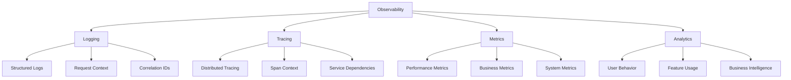
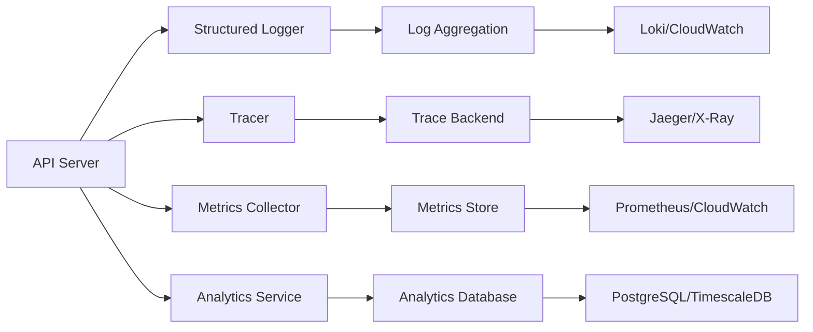

# Observability Overview

Grant Platform provides comprehensive observability capabilities to help you monitor, debug, and optimize your deployment. This guide covers the four pillars of observability implemented in the platform.

## The Four Pillars



## Why Observability Matters

### For Developers

- **Debug faster**: Trace requests across services with correlation IDs
- **Understand behavior**: See exactly what your code is doing in production
- **Performance insights**: Identify slow queries and bottlenecks
- **Error tracking**: Get full context when things go wrong

### For DevOps

- **System health**: Monitor resource usage and system metrics
- **Alerting**: Set up intelligent alerts based on metrics
- **Capacity planning**: Track growth and plan infrastructure
- **Incident response**: Quickly identify and resolve issues

### For Business

- **Feature adoption**: Track which features users actually use
- **User behavior**: Understand how customers interact with your platform
- **Cost optimization**: Track resource usage per tenant
- **Compliance**: Maintain detailed audit trails for regulations

## Architecture

Grant Platform's observability stack is designed to work in both self-hosted and cloud environments:



## Components

### 1. Structured Logging

**Technology**: Pino (fast, structured JSON logging)

**Features**:

- JSON-formatted logs for easy parsing
- Request correlation IDs
- Automatic PII redaction
- Multi-level logging (debug, info, warn, error)
- Pretty printing in development

**Learn more**: [Logging Guide](/advanced-topics/logging)

### 2. Distributed Tracing

**Technology**: OpenTelemetry

**Features**:

- End-to-end request tracing
- Automatic instrumentation for HTTP, GraphQL, Database
- Support for multiple backends (Jaeger, AWS X-Ray, Datadog)
- Performance profiling
- Service dependency mapping

**Learn more**: [Tracing Guide](/advanced-topics/tracing)

### 3. Metrics & Monitoring

**Technology**: Prometheus + Custom Metrics

**Features**:

- HTTP request metrics (duration, count, errors)
- GraphQL operation metrics
- Database connection pool metrics
- Cache hit/miss rates
- Authentication and authorization metrics
- Custom business metrics

**Learn more**: [Metrics Guide](/advanced-topics/metrics)

### 4. Business Analytics

**Technology**: PostgreSQL + Optional External Services

**Features**:

- User behavior tracking
- Feature usage analytics
- Multi-tenant analytics
- Custom event tracking
- Integration with external services (Segment, Mixpanel)

**Learn more**: [Analytics Guide](/advanced-topics/analytics)

## Deployment Patterns

### Development Environment

In development, observability focuses on developer experience:

```typescript
// Pretty, human-readable logs
LOG_PRETTY_PRINT=true

// Local tracing with Jaeger UI
TRACING_ENABLED=true
JAEGER_ENDPOINT=http://localhost:14268/api/traces

// Metrics endpoint for local Prometheus
METRICS_ENABLED=true
```

**Tools**:

- Pino Pretty for readable logs
- Jaeger UI for trace visualization
- Prometheus + Grafana for metrics

### Self-Hosted Production

Self-hosted deployments can use open-source tools:

```typescript
// Structured JSON logs
LOG_LEVEL=info
LOG_PRETTY_PRINT=false

// Jaeger or compatible backend
TRACING_ENABLED=true
JAEGER_ENDPOINT=http://jaeger-collector:14268/api/traces

// Expose metrics for Prometheus
METRICS_ENABLED=true
```

**Stack Options**:

- **Logging**: Loki + Grafana, ELK Stack
- **Tracing**: Jaeger, Zipkin
- **Metrics**: Prometheus + Grafana
- **Analytics**: PostgreSQL or TimescaleDB

### AWS/Cloud Production

Cloud deployments leverage managed services:

```typescript
// CloudWatch integration
LOG_LEVEL = info;
CLOUD_PROVIDER = aws;

// AWS X-Ray for distributed tracing
TRACING_ENABLED = true;
TRACING_BACKEND = xray;

// CloudWatch Metrics + Prometheus
METRICS_ENABLED = true;
CLOUDWATCH_METRICS = true;
```

**AWS Stack**:

- **Logging**: CloudWatch Logs
- **Tracing**: AWS X-Ray
- **Metrics**: CloudWatch Metrics + Prometheus
- **Analytics**: RDS PostgreSQL or Timestream

## Quick Start

### 1. Enable Basic Observability

Add to your `.env`:

```bash
# Logging
LOG_LEVEL=info
LOG_PRETTY_PRINT=false

# Metrics
METRICS_ENABLED=true

# Tracing (optional)
TRACING_ENABLED=false
```

### 2. Access Metrics

```bash
# View Prometheus metrics
curl http://localhost:4000/metrics

# Health check with system status
curl http://localhost:4000/health
```

### 3. View Logs

Logs are written to stdout/stderr in JSON format:

```bash
# With Docker
docker logs grant-api

# With PM2
pm2 logs grant-api

# With systemd
journalctl -u grant-api -f
```

### 4. Set Up Tracing (Optional)

Start Jaeger for local development:

```bash
docker run -d --name jaeger \
  -p 16686:16686 \
  -p 14268:14268 \
  jaegertracing/all-in-one:latest

# Enable tracing
export TRACING_ENABLED=true
export JAEGER_ENDPOINT=http://localhost:14268/api/traces

# View traces at http://localhost:16686
```

## Best Practices

### 1. Use Correlation IDs

Every request gets a unique ID that flows through all logs and traces:

```typescript
// Automatically added to all logs
{
  "requestId": "f47ac10b-58cc-4372-a567-0e02b2c3d479",
  "userId": "user-123",
  "accountId": "account-456",
  "msg": "Processing request"
}
```

### 2. Log Structured Data

Always log structured data, not interpolated strings:

```typescript
// ❌ Bad
logger.info(`User ${userId} created organization ${orgId}`);

// ✅ Good
logger.info({
  msg: 'Organization created',
  userId,
  organizationId: orgId,
  action: 'create',
});
```

### 3. Set Appropriate Log Levels

Use log levels correctly:

- **error**: Something failed and requires attention
- **warn**: Something unexpected but handled
- **info**: Important business events and milestones
- **debug**: Detailed information for debugging
- **trace**: Very detailed, typically only in development

### 4. Monitor Key Metrics

Essential metrics to monitor:

- **Request rate**: Requests per second
- **Error rate**: Percentage of failed requests
- **Response time**: P50, P95, P99 latencies
- **Database connections**: Active vs available
- **Cache hit rate**: Percentage of cache hits
- **Authentication success rate**: Auth failures may indicate attacks

### 5. Create Alerts

Set up alerts for critical conditions:

```yaml
# Example Prometheus alert
- alert: HighErrorRate
  expr: rate(http_requests_total{status_code=~"5.."}[5m]) > 0.05
  for: 5m
  annotations:
    summary: 'High error rate detected'
```

### 6. Use Request Context

Always include request context in logs:

```typescript
// Available on all requests
req.logger.info({
  msg: 'Processing request',
  // requestId, userId, accountId already attached
  additionalData: {...}
});
```

## Multi-Tenancy Considerations

Grant Platform is multi-tenant, so observability must support tenant isolation:

### Tenant-Scoped Metrics

```typescript
// Metrics with tenant labels
httpRequestDuration.observe(
  {
    method: req.method,
    route: req.route,
    accountId: req.accountId, // ← Tenant dimension
  },
  duration
);
```

### Tenant-Scoped Logs

```typescript
// Logs automatically include tenant context
logger.child({
  accountId: 'account-123',
  organizationId: 'org-456',
});
```

### Analytics by Tenant

```typescript
// Track tenant-specific events
analytics.track({
  event: 'feature.used',
  accountId: 'account-123',
  organizationId: 'org-456',
  properties: { feature: 'advanced-permissions' },
});
```

## Cost Optimization

Observability can generate significant data volume. Optimize costs:

### Sampling

```typescript
// Sample traces in high-volume environments
TRACING_SAMPLING_RATE = 0.1; // 10% of traces
```

### Log Retention

```typescript
// Configure retention policies
LOG_RETENTION_DAYS = 30; // Keep logs for 30 days
METRICS_RETENTION_DAYS = 90; // Keep metrics for 90 days
```

### Smart Filtering

```typescript
// Don't log health checks
if (req.path === '/health') return;

// Sample high-volume endpoints
if (Math.random() > 0.1) return; // 10% sampling
```

## Security & Compliance

### PII Protection

Automatic redaction of sensitive data:

```typescript
// Automatically redacted fields
redact: [
  'req.headers.authorization',
  'req.headers.cookie',
  '*.password',
  '*.token',
  '*.secret',
  '*.apiKey',
];
```

### Audit Trails

Comprehensive audit logging for compliance:

- User authentication events
- Permission changes
- Data access and modifications
- Administrative actions

See: [Audit Logging Guide](/advanced-topics/audit-logging)

## Next Steps

1. **Set up logging**: [Logging Guide](/advanced-topics/logging)
2. **Add metrics**: [Metrics Guide](/advanced-topics/metrics)
3. **Enable tracing**: [Tracing Guide](/advanced-topics/tracing)
4. **Track analytics**: [Analytics Guide](/advanced-topics/analytics)

## Resources

### Tools & Services

**Open Source**:

- [Pino](https://getpino.io/) - Fast JSON logger
- [OpenTelemetry](https://opentelemetry.io/) - Observability framework
- [Prometheus](https://prometheus.io/) - Metrics and monitoring
- [Grafana](https://grafana.com/) - Visualization
- [Jaeger](https://www.jaegertracing.io/) - Distributed tracing
- [Loki](https://grafana.com/oss/loki/) - Log aggregation

**Commercial**:

- AWS CloudWatch, X-Ray
- Datadog
- New Relic
- Honeycomb
- Sentry

### Learning Resources

- [Google SRE Book - Monitoring](https://sre.google/sre-book/monitoring-distributed-systems/)
- [OpenTelemetry Getting Started](https://opentelemetry.io/docs/getting-started/)
- [Prometheus Best Practices](https://prometheus.io/docs/practices/)
- [The Three Pillars of Observability](https://www.oreilly.com/library/view/distributed-systems-observability/9781492033431/)

---

**Next**: Start with [Structured Logging](/advanced-topics/logging) →
