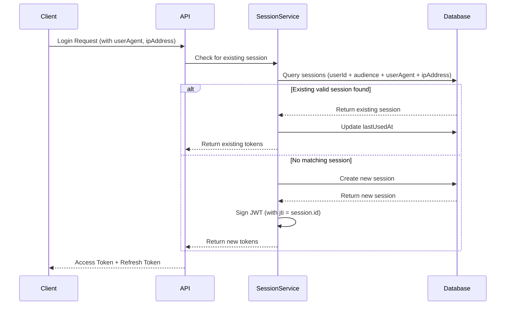

# Security & Session Management

Grant Platform implements a comprehensive security model with JWT-based authentication, device-aware session management, and fine-grained access control.

## Authentication Architecture

### Authentication Methods

Users can authenticate using multiple methods:

- **Email/Password** - Traditional email and password authentication
- **OAuth Providers** - Google, GitHub, and other OAuth providers
- **Future** - Additional providers can be added via the adapter pattern

Each authentication method is stored in the `user_authentication_methods` table and can be verified independently.

### JWT Token Structure

Access tokens are JWT tokens containing:

```typescript
{
  sub: string; // User ID
  aud: string; // Audience (account scope, e.g., "account:uuid")
  exp: number; // Expiration timestamp
  iat: number; // Issued at timestamp
  jti: string; // JWT ID (Session ID)
}
```

The `jti` (JWT ID) claim contains the session ID, allowing the system to identify and revoke specific sessions.

## Session Management

### Device-Aware Sessions

Sessions are **unique per device** based on a combination of:

- **User ID** - The authenticated user
- **Audience** - The account scope (e.g., `account:uuid`)
- **User Agent** - Browser/client identifier
- **IP Address** - Client IP address

This ensures that:

- Users can have multiple active sessions (one per device/browser)
- Each device maintains its own session independently
- Sessions can be individually revoked without affecting other devices
- Security is enhanced by tracking device-specific information

### Session Lifecycle



### Session Storage

Sessions are stored in the `user_sessions` table with the following structure:

```sql
CREATE TABLE user_sessions (
  id UUID PRIMARY KEY,
  user_id UUID NOT NULL,
  user_authentication_method_id UUID NOT NULL,
  token VARCHAR(255) UNIQUE NOT NULL,  -- Refresh token
  audience VARCHAR(255) NOT NULL,        -- Account scope
  expires_at TIMESTAMP NOT NULL,
  last_used_at TIMESTAMP,
  user_agent VARCHAR(500),              -- Device identifier
  ip_address VARCHAR(45),                -- Client IP
  created_at TIMESTAMP NOT NULL,
  updated_at TIMESTAMP NOT NULL,
  deleted_at TIMESTAMP
);
```

### Session Identification

The current session is identified by extracting the `jti` claim from the JWT access token:

```typescript
// Frontend: Extract current session ID
const accessToken = getStoredAccessToken();
const decoded = jwtDecode(accessToken);
const currentSessionId = decoded.jti; // Session ID
```

### IP Address Extraction

The system properly extracts IP addresses considering proxy/load balancer scenarios:

1. **X-Forwarded-For** header (for proxies/load balancers) - takes first IP
2. **X-Real-IP** header (common in nginx)
3. **req.ip** (Express fallback, requires trust proxy)

```typescript
function getClientIp(req: Request): string | null {
  const forwardedFor = req.headers['x-forwarded-for'];
  if (forwardedFor) {
    return forwardedFor.split(',')[0].trim();
  }

  const realIp = req.headers['x-real-ip'];
  if (realIp) {
    return realIp;
  }

  return req.ip || null;
}
```

## Session Operations

### Creating Sessions

Sessions are created during:

1. **Login** - When a user authenticates
2. **Registration** - When a new account is created

The system checks for an existing session matching the device (`userAgent + ipAddress`) before creating a new one. If a matching valid session exists, it's reused and `lastUsedAt` is updated.

### Refreshing Sessions

Sessions can be refreshed using the refresh token. The refresh operation:

1. Validates the refresh token
2. Updates `lastUsedAt` timestamp
3. Issues new access and refresh tokens
4. Maintains the same session ID (`jti`)

### Revoking Sessions

Sessions can be revoked individually:

- **Current Session** - User is immediately logged out and redirected to login
- **Other Sessions** - Only that specific device is logged out

When revoking the current session, users see a warning dialog explaining they will be logged out immediately.

### Session Expiration

Sessions have two expiration timestamps:

- **Access Token** - Short-lived (typically 15 minutes)
- **Refresh Token** - Long-lived (typically 30 days)

Expired sessions are automatically filtered out when querying active sessions.

## Security Features

### Session Isolation

- Sessions are isolated per user and account scope
- Each device/browser combination gets its own session
- Revoking one session doesn't affect others

### Session Tracking

- **Device Information** - User agent string identifies browser/device
- **IP Address** - Tracks the origin of the session
- **Last Used** - Timestamp of last activity
- **Expiration** - Automatic expiration of inactive sessions

### CSRF Protection

**Current Status:** Partially Protected

The platform uses multiple layers of CSRF protection:

1. **JWT in Authorization Headers** - All authenticated requests use `Authorization: Bearer <token>` headers, which are **not vulnerable to CSRF** because browsers don't automatically send custom headers in cross-site requests.

2. **SameSite Cookie Attribute** - Cookies use `sameSite: 'lax'` which provides partial protection by blocking cross-site POST/PUT/DELETE requests.

3. **Apollo Server CSRF Prevention** - GraphQL endpoints have built-in CSRF protection enabled via Apollo Server's `csrfPrevention` feature.

4. **CSRF Token Protection** - Full CSRF token implementation is planned (see [CSRF Protection Implementation Plan](../implementation-plans/csrf-protection.md)).

**Why Additional CSRF Protection is Recommended:**
- Defense in depth (multiple security layers)
- Future-proofing for cookie-based authentication
- Industry best practice and compliance requirements
- Protection against edge cases

### Security Best Practices

1. **HTTPS Only** - Tokens should only be transmitted over HTTPS
2. **HttpOnly Cookies** - Refresh tokens stored in HttpOnly cookies (when applicable)
3. **Token Rotation** - Refresh tokens are rotated on use
4. **Session Revocation** - Users can revoke suspicious sessions
5. **Audit Logging** - All session operations are logged
6. **CSRF Protection** - CSRF tokens for state-changing operations (planned)

## User Session Management UI

Users can manage their sessions through the Security Settings page:

### Features

- **View Active Sessions** - List all active sessions with device info
- **Current Session Indicator** - Clearly marked current session
- **Session Details** - Device type, browser, IP address, last used
- **Revoke Sessions** - Individual session revocation with confirmation
- **Current Session Warning** - Special warning when revoking current session

### Session Display

Each session shows:

- Device icon (mobile/tablet/desktop)
- Browser name (Chrome, Firefox, Safari, etc.)
- IP address
- Last used timestamp
- Expiration date
- Current session badge (if applicable)

## API Endpoints

### GraphQL

```graphql
# Query user sessions
query GetUserSessions($input: GetUserSessionsInput!) {
  userSessions(input: $input) {
    userSessions {
      id
      audience
      expiresAt
      lastUsedAt
      userAgent
      ipAddress
      createdAt
    }
    totalCount
    hasNextPage
  }
}

# Revoke a session
mutation RevokeUserSession($input: RevokeUserSessionInput!) {
  revokeUserSession(input: $input)
}
```

### REST API

```http
# Get user sessions
GET /api/users/:id/sessions?page=1&limit=50

# Revoke a session
DELETE /api/users/:id/sessions/:sessionId
```

## Implementation Details

### Context Middleware

Request context includes device information:

```typescript
interface RequestContext {
  user: AuthenticatedUser | null;
  handlers: Handlers;
  origin: string;
  locale: SupportedLocale;
  userAgent: string | null; // Extracted from headers
  ipAddress: string | null; // Extracted with proxy support
}
```

### Login Handler

The login handler checks for existing sessions before creating new ones:

```typescript
// Check for existing session with same device
const matchingSession = userSessions.find(
  (session) =>
    session.expiresAt > new Date() &&
    session.userAgent === userAgent &&
    session.ipAddress === ipAddress
);

if (matchingSession) {
  // Reuse existing session
  return signSession(matchingSession);
}

// Create new session
return createSession({
  userId,
  audience,
  userAgent,
  ipAddress,
});
```

## Future Enhancements

Potential improvements to session management:

1. **CSRF Token Protection** - Full implementation of CSRF tokens for all state-changing operations (see [Implementation Plan](../implementation-plans/csrf-protection.md))
2. **Device Fingerprinting** - More sophisticated device identification using browser fingerprinting libraries
3. **Geolocation** - Track session location for security alerts
4. **Session Limits** - Configurable maximum concurrent sessions per user
5. **Automatic Revocation** - Revoke sessions based on suspicious activity
6. **Session Notifications** - Email alerts for new device logins

## Related Documentation

- [Multi-Tenancy Architecture](./multi-tenancy.md) - Account-based isolation
- [RBAC/ACL System](./rbac-acl.md) - Permission and access control
- [Data Model](./data-model.md) - Database schema details
- [File Storage](./file-storage.md) - Secure file handling
