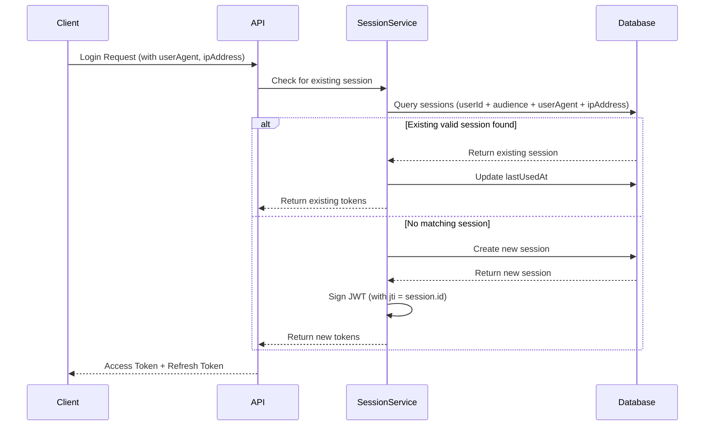

# Security & Session Management

Grant Platform implements a comprehensive security model with JWT-based authentication, device-aware session management, and fine-grained access control.

## Authentication Architecture

### Authentication Methods

Users can authenticate using multiple methods, each stored independently in the `user_authentication_methods` table:

- **Email/Password** - Traditional email and password authentication with email verification
- **GitHub OAuth** - OAuth-based authentication using GitHub accounts
- **Future Providers** - Additional OAuth providers (Google, Microsoft, etc.) can be added via the adapter pattern

#### Primary Authentication Method

Each user must have exactly **one primary authentication method** (`isPrimary: true`):

- The first authentication method created during registration is automatically set as primary
- Users can change their primary method at any time
- The primary method cannot be deleted (users must set another method as primary first)
- Users cannot delete their last remaining authentication method

#### Authentication Method Management

Users can manage their authentication methods through the Security Settings page:

- **Connect Methods** - Add new authentication providers (GitHub OAuth, additional email addresses)
- **Disconnect Methods** - Remove authentication methods (except primary and last remaining)
- **Set Primary** - Change which authentication method is used as the primary
- **Change Password** - Update password for email authentication methods
- **Verification Status** - View verification status for each method

#### GitHub OAuth Flow

GitHub OAuth authentication follows the standard OAuth 2.0 authorization code flow:

1. **Initiation** - User clicks "Connect GitHub" → Redirected to GitHub authorization page
2. **Authorization** - User authorizes the application on GitHub
3. **Callback** - GitHub redirects back with authorization code
4. **Token Exchange** - Backend exchanges code for access token
5. **User Info** - Backend fetches user information from GitHub API
6. **Account Linking** - System creates or links authentication method to user account

The OAuth flow supports three actions:

- **Login** - Authenticate existing user
- **Register** - Create new account with GitHub
- **Connect** - Link GitHub to existing authenticated user account

#### Security Constraints

- **Duplicate Prevention** - Users cannot have multiple authentication methods of the same provider
- **Cross-User Protection** - A GitHub account cannot be linked to multiple user accounts
- **Last Method Protection** - Users must always have at least one authentication method
- **Primary Protection** - The primary authentication method cannot be deleted

### JWT Token Structure

Access tokens are JWT tokens containing:

```typescript
{
  sub: string; // User ID
  aud: string; // Audience (account scope, e.g., "account:uuid")
  exp: number; // Expiration timestamp
  iat: number; // Issued at timestamp
  jti: string; // JWT ID (Session ID)
}
```

The `jti` (JWT ID) claim contains the session ID, allowing the system to identify and revoke specific sessions.

## Session Management

### Device-Aware Sessions

Sessions are **unique per device** based on a combination of:

- **User ID** - The authenticated user
- **Audience** - The account scope (e.g., `account:uuid`)
- **User Agent** - Browser/client identifier
- **IP Address** - Client IP address

This ensures that:

- Users can have multiple active sessions (one per device/browser)
- Each device maintains its own session independently
- Sessions can be individually revoked without affecting other devices
- Security is enhanced by tracking device-specific information

### Session Lifecycle



### Session Storage

Sessions are stored in the `user_sessions` table with the following structure:

```sql
CREATE TABLE user_sessions (
  id UUID PRIMARY KEY,
  user_id UUID NOT NULL,
  user_authentication_method_id UUID NOT NULL,
  token VARCHAR(255) UNIQUE NOT NULL,  -- Refresh token
  audience VARCHAR(255) NOT NULL,        -- Account scope
  expires_at TIMESTAMP NOT NULL,
  last_used_at TIMESTAMP,
  user_agent VARCHAR(500),              -- Device identifier
  ip_address VARCHAR(45),                -- Client IP
  created_at TIMESTAMP NOT NULL,
  updated_at TIMESTAMP NOT NULL,
  deleted_at TIMESTAMP
);
```

### Session Identification

The current session is identified by extracting the `jti` claim from the JWT access token:

```typescript
// Frontend: Extract current session ID
const accessToken = getStoredAccessToken();
const decoded = jwtDecode(accessToken);
const currentSessionId = decoded.jti; // Session ID
```

### IP Address Extraction

The system properly extracts IP addresses considering proxy/load balancer scenarios:

1. **X-Forwarded-For** header (for proxies/load balancers) - takes first IP
2. **X-Real-IP** header (common in nginx)
3. **req.ip** (Express fallback, requires trust proxy)

```typescript
function getClientIp(req: Request): string | null {
  const forwardedFor = req.headers['x-forwarded-for'];
  if (forwardedFor) {
    return forwardedFor.split(',')[0].trim();
  }

  const realIp = req.headers['x-real-ip'];
  if (realIp) {
    return realIp;
  }

  return req.ip || null;
}
```

## Session Operations

### Creating Sessions

Sessions are created during:

1. **Login** - When a user authenticates
2. **Registration** - When a new account is created

The system checks for an existing session matching the device (`userAgent + ipAddress`) before creating a new one. If a matching valid session exists, it's reused and `lastUsedAt` is updated.

### Refreshing Sessions

Sessions can be refreshed using the refresh token. The refresh operation:

1. Validates the refresh token
2. Updates `lastUsedAt` timestamp
3. Issues new access and refresh tokens
4. Maintains the same session ID (`jti`)

### Revoking Sessions

Sessions can be revoked individually:

- **Current Session** - User is immediately logged out and redirected to login
- **Other Sessions** - Only that specific device is logged out

When revoking the current session, users see a warning dialog explaining they will be logged out immediately.

### Session Expiration

Sessions have two expiration timestamps:

- **Access Token** - Short-lived (typically 15 minutes)
- **Refresh Token** - Long-lived (typically 30 days)

Expired sessions are automatically filtered out when querying active sessions.

## Security Features

### Session Isolation

- Sessions are isolated per user and account scope
- Each device/browser combination gets its own session
- Revoking one session doesn't affect others

### Session Tracking

- **Device Information** - User agent string identifies browser/device
- **IP Address** - Tracks the origin of the session
- **Last Used** - Timestamp of last activity
- **Expiration** - Automatic expiration of inactive sessions

### CSRF Protection

**Current Status:** Partially Protected

The platform uses multiple layers of CSRF protection:

1. **JWT in Authorization Headers** - All authenticated requests use `Authorization: Bearer <token>` headers, which are **not vulnerable to CSRF** because browsers don't automatically send custom headers in cross-site requests.

2. **SameSite Cookie Attribute** - Cookies use `sameSite: 'lax'` which provides partial protection by blocking cross-site POST/PUT/DELETE requests.

3. **Apollo Server CSRF Prevention** - GraphQL endpoints have built-in CSRF protection enabled via Apollo Server's `csrfPrevention` feature.

4. **CSRF Token Protection** - Full CSRF token implementation is planned (see [CSRF Protection Implementation Plan](../implementation-plans/csrf-protection.md)).

**Why Additional CSRF Protection is Recommended:**

- Defense in depth (multiple security layers)
- Future-proofing for cookie-based authentication
- Industry best practice and compliance requirements
- Protection against edge cases

### Authentication Method Security

- **Email Verification** - Email authentication methods require verification via OTP before use
- **Password Hashing** - Passwords are hashed using bcrypt before storage
- **OTP Expiration** - Email verification OTPs expire after a configured time period
- **Provider Data Encryption** - Sensitive OAuth provider data (tokens, etc.) stored securely
- **Duplicate Prevention** - System prevents multiple methods of the same provider per user
- **Cross-User Validation** - Prevents linking OAuth accounts already connected to other users

### Security Best Practices

1. **HTTPS Only** - Tokens should only be transmitted over HTTPS
2. **HttpOnly Cookies** - Refresh tokens stored in HttpOnly cookies (when applicable)
3. **Token Rotation** - Refresh tokens are rotated on use
4. **Session Revocation** - Users can revoke suspicious sessions
5. **Audit Logging** - All session and authentication method operations are logged
6. **CSRF Protection** - CSRF tokens for state-changing operations (planned)
7. **OAuth State Validation** - OAuth flows use state parameters for CSRF protection
8. **Primary Method Enforcement** - System ensures exactly one primary authentication method per user

## User Security Management UI

Users can manage their security settings through the Security Settings page:

### Authentication Methods Management

The authentication methods section displays all available providers and their connection status:

- **Provider List** - Shows all available providers (Email, GitHub, etc.)
- **Connection Status** - Indicates whether each provider is connected
- **Primary Badge** - Highlights the primary authentication method
- **Verification Status** - Shows verified/unverified status for each method
- **Provider Actions** - Dropdown menu with available actions:
  - Connect (for unconnected providers)
  - Set as Primary (for non-primary connected methods)
  - Change Password (for email methods)
  - Disconnect (for non-primary, non-last methods)

#### Adding Email Authentication Methods

Users can add additional email/password authentication methods:

- Form includes email, password, and password confirmation
- Password strength indicator validates password requirements
- Verification email is automatically sent upon creation
- Email must be verified before use

#### OAuth Connection Flow

When connecting OAuth providers (e.g., GitHub):

- User clicks "Connect" → Redirected to provider authorization page
- After authorization → Redirected back to settings page
- Success/error indicators shown via URL query parameters
- UI automatically refreshes to show updated connection status

### Session Management

Users can manage their active sessions:

- **View Active Sessions** - List all active sessions with device info
- **Current Session Indicator** - Clearly marked current session
- **Session Details** - Device type, browser, IP address, last used
- **Revoke Sessions** - Individual session revocation with confirmation
- **Current Session Warning** - Special warning when revoking current session

#### Session Display

Each session shows:

- Device icon (mobile/tablet/desktop)
- Browser name (Chrome, Firefox, Safari, etc.)
- IP address
- Last used timestamp
- Expiration date
- Current session badge (if applicable)

## API Endpoints

### GraphQL

#### Authentication Methods

```graphql
# Query user authentication methods
query GetUserAuthenticationMethods($input: GetUserAuthenticationMethodsInput!) {
  userAuthenticationMethods(input: $input) {
    id
    userId
    provider
    providerId
    isVerified
    isPrimary
    lastUsedAt
    createdAt
    updatedAt
  }
}

# Create authentication method (e.g., add email)
mutation CreateUserAuthenticationMethod($input: CreateUserAuthenticationMethodInput!) {
  createUserAuthenticationMethod(input: $input) {
    id
    provider
    providerId
    isVerified
    isPrimary
  }
}

# Set primary authentication method
mutation SetPrimaryAuthenticationMethod($id: ID!) {
  setPrimaryAuthenticationMethod(id: $id) {
    id
    isPrimary
  }
}

# Delete authentication method
mutation DeleteUserAuthenticationMethod($input: DeleteUserAuthenticationMethodInput!) {
  deleteUserAuthenticationMethod(input: $input) {
    id
  }
}
```

#### User Sessions

```graphql
# Query user sessions
query GetUserSessions($input: GetUserSessionsInput!) {
  userSessions(input: $input) {
    userSessions {
      id
      audience
      expiresAt
      lastUsedAt
      userAgent
      ipAddress
      createdAt
    }
    totalCount
    hasNextPage
  }
}

# Revoke a session
mutation RevokeUserSession($input: RevokeUserSessionInput!) {
  revokeUserSession(input: $input)
}
```

### REST API

#### OAuth Endpoints

```http
# Initiate GitHub OAuth flow
GET /api/auth/github?action=connect&redirect=<redirect_url>

# GitHub OAuth callback (handled by GitHub)
GET /api/auth/github/callback?code=<code>&state=<state>
```

#### User Sessions

```http
# Get user sessions
GET /api/users/:id/sessions?page=1&limit=50

# Revoke a session
DELETE /api/users/:id/sessions/:sessionId
```

## Implementation Details

### Context Middleware

Request context includes device information:

```typescript
interface RequestContext {
  user: AuthenticatedUser | null;
  handlers: Handlers;
  origin: string;
  locale: SupportedLocale;
  userAgent: string | null; // Extracted from headers
  ipAddress: string | null; // Extracted with proxy support
}
```

### Login Handler

The login handler checks for existing sessions before creating new ones:

```typescript
// Check for existing session with same device
const matchingSession = userSessions.find(
  (session) =>
    session.expiresAt > new Date() &&
    session.userAgent === userAgent &&
    session.ipAddress === ipAddress
);

if (matchingSession) {
  // Reuse existing session
  return signSession(matchingSession);
}

// Create new session
return createSession({
  userId,
  audience,
  userAgent,
  ipAddress,
});
```

## Future Enhancements

Potential improvements to authentication and session management:

### Authentication Methods

1. **Additional OAuth Providers** - Google, Microsoft, Apple Sign-In, etc.
2. **Multi-Factor Authentication (MFA)** - TOTP, SMS, or hardware keys
3. **WebAuthn/Passkeys** - Passwordless authentication using biometrics
4. **Account Recovery** - Enhanced recovery flows for lost authentication methods

### Session Management

1. **CSRF Token Protection** - Full implementation of CSRF tokens for all state-changing operations (see [Implementation Plan](../implementation-plans/csrf-protection.md))
2. **Device Fingerprinting** - More sophisticated device identification using browser fingerprinting libraries
3. **Geolocation** - Track session location for security alerts
4. **Session Limits** - Configurable maximum concurrent sessions per user
5. **Automatic Revocation** - Revoke sessions based on suspicious activity
6. **Session Notifications** - Email alerts for new device logins and OAuth connections

## Related Documentation

- [Multi-Tenancy Architecture](./multi-tenancy.md) - Account-based isolation
- [RBAC/ACL System](./rbac-acl.md) - Permission and access control
- [Data Model](./data-model.md) - Database schema details
- [File Storage](./file-storage.md) - Secure file handling
