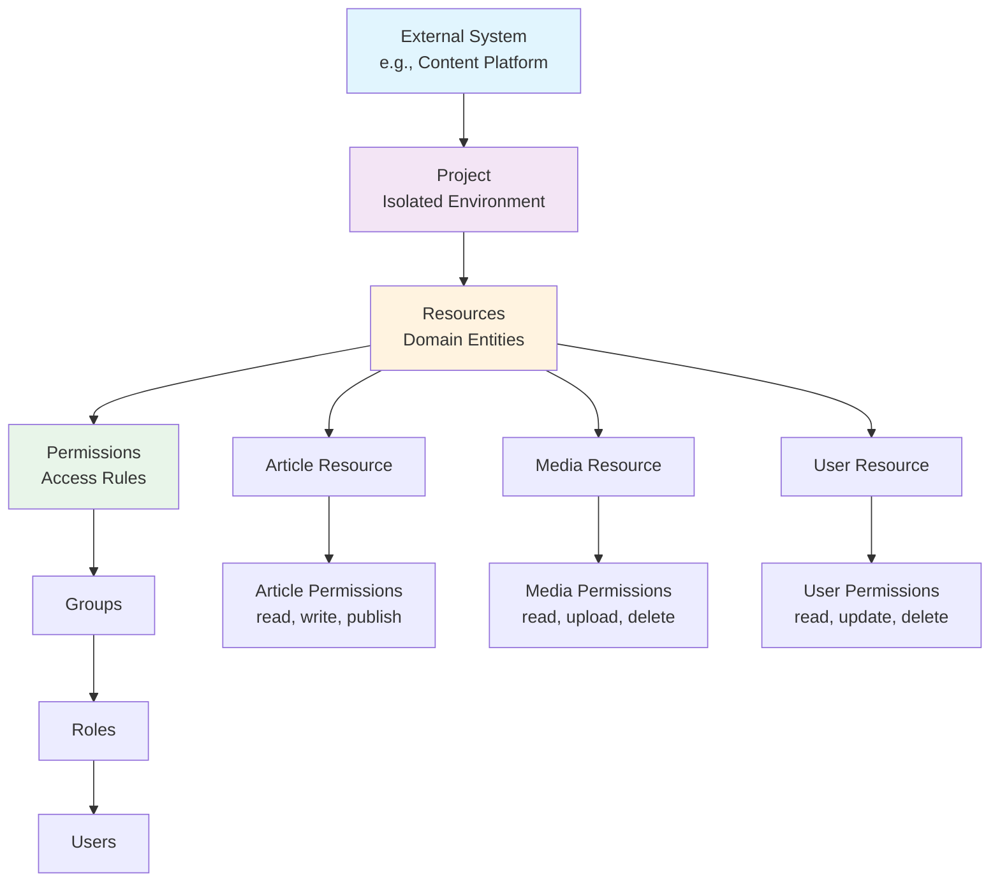
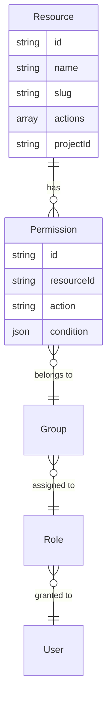
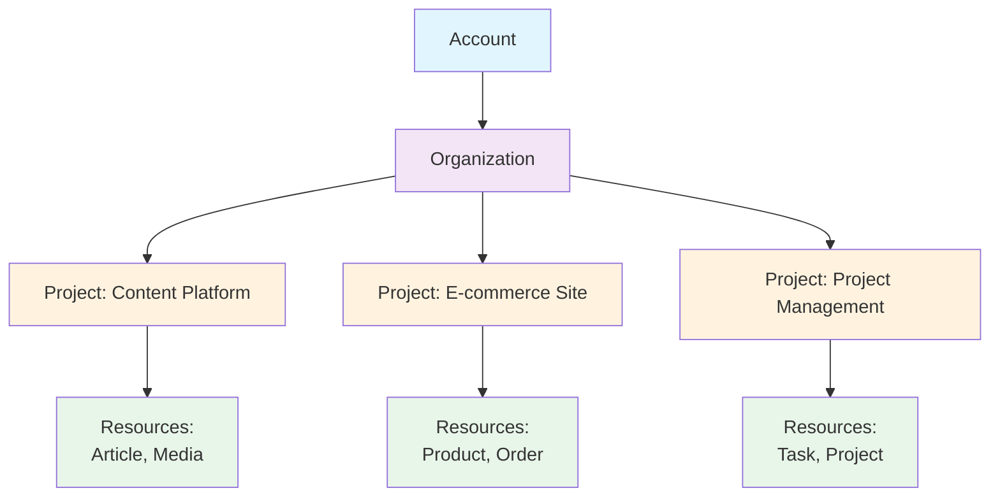
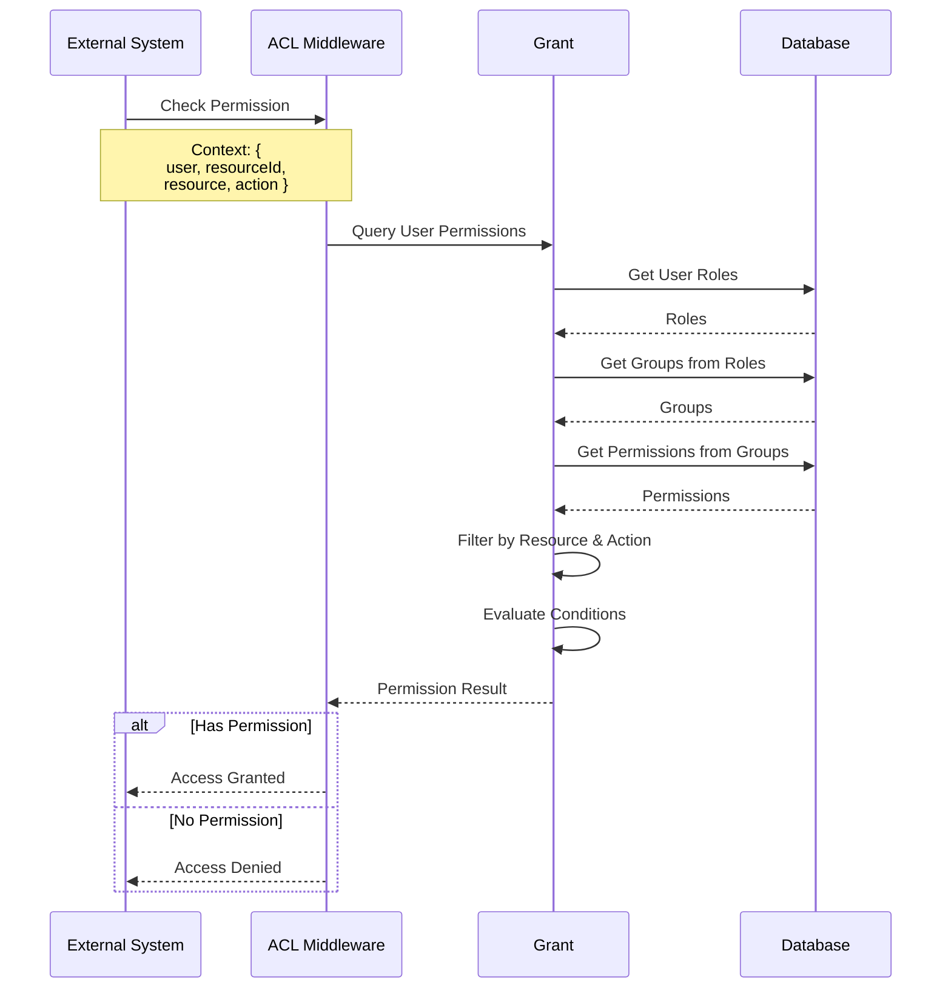
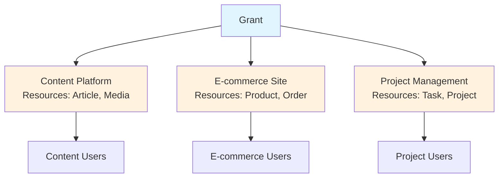
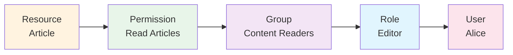

# Resources

Resources are a core concept in Grant that enable external systems to model their domain entities (like articles, products, tasks, documents) and connect them to the permission system for fine-grained access control.

## Overview

Resources allow external systems to define their own domain entities within Grant without the platform needing to know about the actual resource data. This enables a flexible, decoupled authorization model where:

- **External systems define their resources** (what entities exist in their domain)
- **Resources are linked to permissions** (what actions can be performed)
- **The platform remains agnostic** about actual resource data and values
- **Fine-grained access control** is achieved through resource-based permissions

## Why Resources?

### The Problem

Traditional RBAC systems often encode resource types directly in permission actions:

```
Permission: "user:read"  → Can read all users
Permission: "article:write" → Can write all articles
```

This approach has limitations:

1. **No External Resource Support**: Cannot define resources that external systems manage
2. **Tight Coupling**: Permission actions must be predefined in the platform
3. **No Instance Control**: Permissions grant access to all resources of a type
4. **Limited Flexibility**: Hard to model domain-specific resources and actions

### The Solution

Resources provide a **first-class entity** for modeling external system domains:



## Core Concepts

### 1. Resources as Domain Models

Resources represent the **types of entities** that external systems manage. Each resource:

- **Is scoped to a project** (each project = one external system)
- **Has a unique name and slug** within the project scope
- **Defines available actions** (read, write, delete, or custom actions)
- **Does NOT store resource data** (only metadata and access rules)

**Example Resources for Different Systems:**

```typescript
// Content Management System
{
  name: "Article",
  slug: "article",
  actions: ["read", "write", "delete", "publish", "archive"]
}

// E-commerce Platform
{
  name: "Product",
  slug: "product",
  actions: ["read", "create", "update", "delete", "publish"]
}

// Project Management Tool
{
  name: "Task",
  slug: "task",
  actions: ["read", "create", "update", "delete", "assign", "complete"]
}

// Document Management System
{
  name: "Document",
  slug: "document",
  actions: ["read", "create", "update", "delete", "share", "download"]
}
```

### 2. Resource-Permission Connection

Permissions are explicitly linked to resources, creating a clear relationship:



**Key Benefits:**

- **Explicit Relationships**: Clear link between permissions and resources
- **Type Safety**: Resources define valid actions
- **Flexible Actions**: Custom actions per resource type
- **Conditional Access**: Permissions can include conditions for fine-grained control

### 3. Project Scoping

Resources are **scoped to projects**, where each project represents one external system:



**Why Project Scoping?**

- **Isolation**: Each external system has its own resource definitions
- **Flexibility**: Different systems can have different resource structures
- **Security**: Resources are isolated per project
- **Scalability**: Supports multiple external systems per organization

## How Resources Work

### 1. Resource Definition

External systems define their resources within a project:

```graphql
mutation CreateResource {
  createResource(
    scope: { id: "project-123", tenant: organizationProject }
    name: "Article"
    slug: "article"
    description: "Article resource for content management"
    actions: ["read", "write", "delete", "publish", "archive"]
    isActive: true
  ) {
    id
    name
    slug
    actions
  }
}
```

### 2. Permission Creation

Permissions are created and linked to resources:

```graphql
mutation CreatePermission {
  createPermission(
    scope: { id: "project-123", tenant: organizationProject }
    name: "Read Articles"
    resourceId: "resource-article-uuid"
    action: "read"
    description: "Allows reading article content"
  ) {
    id
    name
    resource {
      id
      name
    }
    action
  }
}
```

### 3. Permission with Conditions

Permissions can include conditions for fine-grained access control:

```graphql
mutation CreateConditionalPermission {
  createPermission(
    scope: { id: "project-123", tenant: organizationProject }
    name: "Read Own Articles"
    resourceId: "resource-article-uuid"
    action: "read"
    condition: { type: "ownership", field: "createdBy", operator: "equals", value: "{{user.id}}" }
  ) {
    id
    name
    condition
  }
}
```

### 4. Access Control Flow

When an external system needs to check permissions:



## Resource Actions

Resources define the actions that can be performed on them. Actions can be:

### Standard Actions

Most resources support standard CRUD operations:

- **`read`** - View resource data
- **`write`** - Create or update resources
- **`delete`** - Remove resources
- **`manage`** - Full administrative access

### Custom Actions

Resources can define domain-specific actions:

```typescript
// Article Resource
actions: ['read', 'write', 'delete', 'publish', 'archive', 'draft'];

// Product Resource
actions: ['read', 'create', 'update', 'delete', 'publish', 'unpublish'];

// Task Resource
actions: ['read', 'create', 'update', 'delete', 'assign', 'complete', 'archive'];
```

**Benefits of Custom Actions:**

- **Domain-Specific**: Actions match business logic
- **Granular Control**: Fine-grained permission checks
- **Clear Intent**: Actions clearly express what's allowed
- **Flexible**: Each resource type can have unique actions

## Resource-Permission Relationship

### Direct Connection

Permissions are directly linked to resources:

```typescript
interface Permission {
  id: string;
  name: string;
  resourceId: string; // Links to Resource
  action: string; // Must be in resource.actions
  condition?: JSON; // Optional access condition
  description?: string;
}
```

### Action Validation

When creating a permission, the action must be valid for the resource:

```typescript
// ✅ Valid: "read" is in article.actions
createPermission({
  resourceId: 'article-resource-id',
  action: 'read',
});

// ❌ Invalid: "publish" not in product.actions
createPermission({
  resourceId: 'product-resource-id',
  action: 'publish', // Error: action not defined for resource
});
```

### Permission Evaluation

When checking permissions, the system:

1. **Identifies the resource** from the operation context
2. **Finds permissions** linked to that resource
3. **Matches the action** being performed
4. **Evaluates conditions** if present
5. **Grants or denies access** based on results

## Use Cases

### 1. Multi-System Authorization

A single Grant instance can manage permissions for multiple external systems:



### 2. Fine-Grained Access Control

Resources enable instance-level and attribute-based access control:

```typescript
// Permission: Read only articles in user's department
{
  resourceId: "article-resource-id",
  action: "read",
  condition: {
    type: "attribute_match",
    userField: "metadata.department",
    resourceField: "department"
  }
}

// Permission: Publish only articles with status "reviewed"
{
  resourceId: "article-resource-id",
  action: "publish",
  condition: {
    type: "comparison",
    field: "status",
    operator: "equals",
    value: "reviewed"
  }
}
```

### 3. Domain Modeling

External systems can model their complete domain:

```typescript
// Project Management System Resources
const projectResources = [
  { name: 'Project', actions: ['read', 'write', 'archive', 'delete'] },
  { name: 'Task', actions: ['read', 'create', 'update', 'assign', 'complete'] },
  { name: 'Team', actions: ['read', 'create', 'update', 'manage'] },
  { name: 'Milestone', actions: ['read', 'create', 'update', 'complete'] },
];

// Each resource can have different actions based on business needs
```

## Resource Management

### Creating Resources

Resources are created at the project level:

```typescript
// Create a resource for articles
const articleResource = await createResource({
  scope: { id: projectId, tenant: 'organizationProject' },
  name: 'Article',
  slug: 'article',
  description: 'Article resource for content management',
  actions: ['read', 'write', 'delete', 'publish', 'archive'],
  isActive: true,
});
```

### Resource Uniqueness

Resource slugs must be unique within a project scope:

```typescript
// ✅ Valid: Different projects can have resources with same slug
Project A: { slug: "article" }
Project B: { slug: "article" }  // OK - different projects

// ❌ Invalid: Same project cannot have duplicate slugs
Project A: { slug: "article" }
Project A: { slug: "article" }  // Error: duplicate slug
```

### Resource States

Resources can be active or inactive:

- **Active Resources**: Can be used in permissions and access control
- **Inactive Resources**: Cannot be used in new permissions (existing permissions remain valid)

This allows for:

- **Draft Resources**: Create resources before they're ready
- **Temporary Disabling**: Disable resources without deleting them
- **Gradual Rollout**: Enable resources incrementally

## Best Practices

### 1. Resource Naming

- **Use Clear Names**: `Article` not `Art` or `ART001`
- **Consistent Slugs**: Use lowercase, hyphenated slugs: `article`, `product-order`
- **Descriptive**: Names should clearly indicate what the resource represents

### 2. Action Design

- **Start with Standard Actions**: Use `read`, `write`, `delete` for basic operations
- **Add Custom Actions**: Define domain-specific actions as needed
- **Keep Actions Focused**: Each action should represent a single, clear operation
- **Document Actions**: Describe what each custom action means

### 3. Resource Organization

- **Group Related Resources**: Use tags to organize resources
- **Primary Tags**: Mark important resources with primary tags
- **Consistent Patterns**: Follow similar naming and action patterns across related resources

### 4. Permission Design

- **Resource-First**: Always link permissions to resources
- **Use Conditions**: Leverage conditions for fine-grained control
- **Document Permissions**: Clear names and descriptions help users understand access

### 5. Project Structure

- **One System Per Project**: Each external system should have its own project
- **Isolated Resources**: Resources are isolated per project
- **Clear Boundaries**: Keep resource definitions within their project scope

## Integration with Permissions

Resources are the foundation of the permission system:



**The Flow:**

1. **Resource** defines what can be controlled (Article)
2. **Permission** defines what action is allowed (read)
3. **Group** collects related permissions
4. **Role** assigns groups to users
5. **User** receives access through roles

## Examples

### Example 1: Content Management System

```typescript
// Define resources
const articleResource = await createResource({
  name: 'Article',
  slug: 'article',
  actions: ['read', 'write', 'delete', 'publish', 'archive'],
});

const mediaResource = await createResource({
  name: 'Media',
  slug: 'media',
  actions: ['read', 'upload', 'delete', 'share', 'download'],
});

// Create permissions
await createPermission({
  name: 'Read Articles',
  resourceId: articleResource.id,
  action: 'read',
});

await createPermission({
  name: 'Publish Articles',
  resourceId: articleResource.id,
  action: 'publish',
  condition: {
    type: 'comparison',
    field: 'status',
    operator: 'equals',
    value: 'reviewed',
  },
});
```

### Example 2: E-commerce Platform

```typescript
// Define resources
const productResource = await createResource({
  name: 'Product',
  slug: 'product',
  actions: ['read', 'create', 'update', 'delete', 'publish'],
});

const orderResource = await createResource({
  name: 'Order',
  slug: 'order',
  actions: ['read', 'create', 'update', 'cancel', 'fulfill'],
});

// Create permissions with conditions
await createPermission({
  name: 'Read Own Orders',
  resourceId: orderResource.id,
  action: 'read',
  condition: {
    type: 'ownership',
    field: 'customerId',
    operator: 'equals',
    value: '{{user.id}}',
  },
});
```

### Example 3: Project Management Tool

```typescript
// Define resources
const taskResource = await createResource({
  name: 'Task',
  slug: 'task',
  actions: ['read', 'create', 'update', 'delete', 'assign', 'complete'],
});

const projectResource = await createResource({
  name: 'Project',
  slug: 'project',
  actions: ['read', 'create', 'update', 'delete', 'archive'],
});

// Create permissions
await createPermission({
  name: 'Manage Projects',
  resourceId: projectResource.id,
  action: 'manage',
});

await createPermission({
  name: 'Assign Tasks',
  resourceId: taskResource.id,
  action: 'assign',
  condition: {
    type: 'attribute_match',
    userField: 'metadata.team',
    resourceField: 'team',
  },
});
```

## Resource vs. Permission Actions

It's important to understand the difference:

- **Resource Actions**: Define what actions are **available** for a resource type
- **Permission Actions**: Define what actions are **allowed** for users

```typescript
// Resource defines available actions
const articleResource = {
  actions: ['read', 'write', 'delete', 'publish', 'archive'],
};

// Permissions grant specific actions
const readPermission = {
  resourceId: articleResource.id,
  action: 'read', // Must be in resource.actions
};

const publishPermission = {
  resourceId: articleResource.id,
  action: 'publish', // Must be in resource.actions
};
```

## Migration from Action Strings

If you're migrating from the old action string format:

**Before (Action Strings):**

```typescript
{
  action: 'article:read'; // Resource encoded in action
}
```

**After (Resource-Based):**

```typescript
{
  resourceId: "article-resource-id",
  action: "read"  // Resource is explicit
}
```

**Benefits:**

- **Explicit Relationships**: Clear link between permissions and resources
- **Type Safety**: Actions validated against resource definitions
- **Flexibility**: Easy to add new actions to resources
- **Better Organization**: Resources can be managed independently

## Summary

Resources are a powerful feature that enables:

- ✅ **Domain Modeling**: External systems can model their entities
- ✅ **Flexible Actions**: Custom actions per resource type
- ✅ **Fine-Grained Control**: Resource-based permissions with conditions
- ✅ **Project Isolation**: Resources scoped per project
- ✅ **Type Safety**: Actions validated against resource definitions
- ✅ **Decoupled Design**: Platform remains agnostic about resource data

Resources form the foundation of Grant's flexible authorization model, enabling external systems to define their domain and control access with precision.

---

**Next:** Learn about [Groups & Permissions](/core-concepts/groups-permissions) to understand how permissions are organized and assigned.
