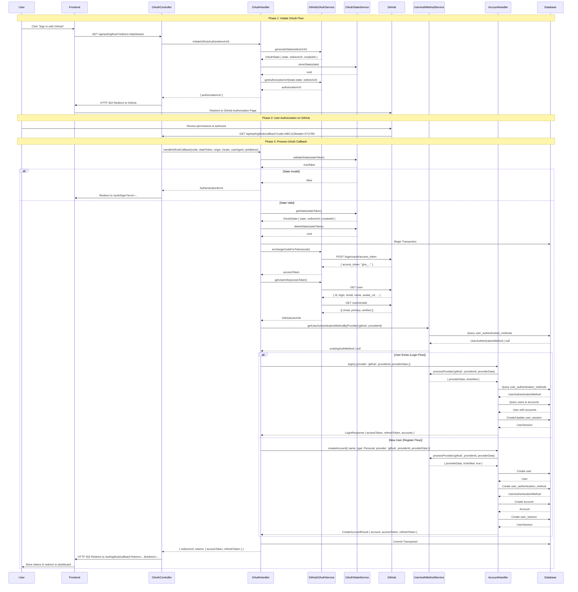

# GitHub OAuth Flow - Sequence Diagram

## Overview

This document illustrates the complete GitHub OAuth authentication flow using a sequence diagram.

## Sequence Diagram

## Flow Phases

### Phase 1: Initiate OAuth Flow

1. User clicks "Sign in with GitHub" button
2. Frontend redirects to backend OAuth initiation endpoint
3. Backend generates CSRF state token
4. Backend stores state token in memory
5. Backend redirects user to GitHub authorization page

### Phase 2: User Authorization

1. User reviews permissions on GitHub
2. User authorizes the application
3. GitHub redirects back to callback URL with authorization code and state

### Phase 3: Process OAuth Callback

1. Backend validates state token (CSRF protection)
2. Backend exchanges authorization code for access token
3. Backend fetches user information from GitHub API
4. Backend checks if user already exists
5. **If user exists**: Login flow - create session
6. **If new user**: Register flow - create user, account, and session
7. Backend redirects to frontend with tokens
8. Frontend stores tokens and redirects user to dashboard

## Key Components

- **OAuthController**: Handles HTTP requests/responses and redirects
- **OAuthHandler**: Orchestrates the OAuth flow with transactions
- **GitHubOAuthService**: Communicates with GitHub API (token exchange, user info)
- **OAuthStateService**: Manages CSRF state tokens
- **AccountHandler**: Handles login/register logic
- **UserAuthenticationMethodService**: Manages authentication methods

## Security Features

- **CSRF Protection**: State token validation prevents CSRF attacks
- **One-time State**: State tokens are deleted after use
- **State Expiration**: States expire after 10 minutes
- **Transaction Safety**: All database operations are wrapped in transactions
