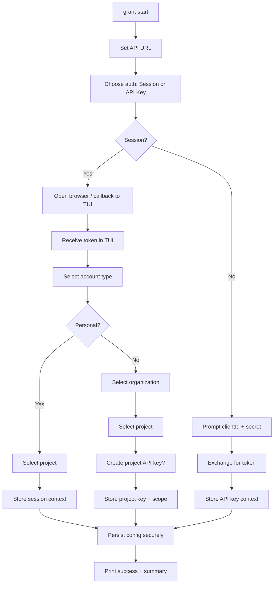
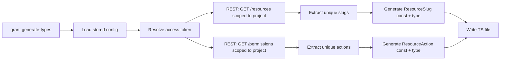

# Grant CLI/TUI - Implementation Plan

> **Status**: Draft | **Depends on**: [ACL Engine](acl-engine.md) Phase 1–3 ✅ | [Project-Level API Keys and CLI/TUI Typings](project-level-api-keys-and-cli-typings.md) ✅

## Overview

This document specifies the design and implementation of the **Grant CLI** (program name: `grant`): a terminal-based tool for configuring authentication, selecting account/project, managing project-level API keys, and generating TypeScript typings from a project's permission model. The CLI provides both a **session-based flow** (authenticate via web app, callback into TUI) and an **API-key flow** (clientId + secret, exchange for token), then uses the selected project context for **typings generation** so that `@grantjs/server` can integrate guards with type-safe resource slugs and actions.

**Related plans**:

- [ACL Engine](acl-engine.md) – Phase 4 (grant-cli); CLI architecture and dependencies.
- [Project-Level API Keys and CLI/TUI Typings](project-level-api-keys-and-cli-typings.md) – Project-level API keys (AccountProject / OrganizationProject), exchange flow, and typings context.

**Scope for this plan**:

- **MVP**: Binary name `grant`; basic commands (`version`, `help`); main setup command `grant start` (or `grant setup`); and `grant generate-types` to emit project-scoped `ResourceSlug` and `ResourceAction` constants for use with `@grantjs/server`.
- **Out of scope for MVP**: Project init (scaffold config/frameworks), advanced API key management from CLI, MCP/LLM-assisted flows.

---

## Problem Statement

### Current State

1. **No unified CLI**  
   Developers must configure API URL, obtain API keys (via web app), and call the REST API manually. There is no single entrypoint to “set up Grant” for a host and get credentials usable by tooling.

2. **Typings are platform-defined only**  
   `@grantjs/constants` defines a fixed `ResourceSlug` and `ResourceAction` set. Projects that define their own resources and permissions in the Grant platform cannot get type-safe constants that match their **project-specific** model, making `@grantjs/server` guards less safe (string literals or manual sync).

3. **Session vs API key is manual**  
   Session auth (web login) and API-key auth (clientId/secret exchange) exist in the API but are not wired into a single CLI flow with secure storage and project selection.

### Requirements

- **Single binary**: Program name `grant`; subcommands `grant <command>`.
- **Basic commands**: `grant version`, `grant help` (and `--help` on any command).
- **Setup command** (`grant start` or `grant setup`): Guided flow that:
  - Configures **API URL** (Grant app can be hosted anywhere).
  - Chooses **authentication method**: session or API key.
  - **Login**:
    - **Session**: Auth via web app with callback into TUI (e.g. open browser → user logs in → callback URL returns token/code to CLI).
    - **API key**: Prompt for clientId + secret; verify by exchanging for access token.
  - **Select context** (for session flow): Account (personal vs organization) → Project.
    - Personal account → select project.
    - Organization account → select organization → select project → optionally **create project API key** and store it.
  - **Secure storage**: Persist API URL, auth method, and credentials (session token or project API key + scope) in platform-appropriate secure storage.
  - **Completion output**: Clear success message and summary of stored config (e.g. API URL, scope, “project API key stored” or “session active”).
- **Generate-types command** (`grant generate-types`): For the **selected project** (from stored context):
  - Query the project’s **resources** and **permissions** via REST (existing scoped endpoints).
  - Generate a **project-specific** TypeScript file (or module) containing:
    - **ResourceSlug**: const/object and type derived from the project’s resources (e.g. `slug` or equivalent), mirroring the shape of `@grantjs/constants` `ResourceSlug` (see [resources.ts](../../packages/@grantjs/constants/src/permissions/resources.ts)).
    - **ResourceAction**: const/object and type as the **unique set of actions** from the project’s permissions (e.g. `project.permissions[*].action`), mirroring [ResourceAction](../../packages/@grantjs/constants/src/permissions/resources.ts).
  - Output format and path configurable (e.g. `./grant-types.ts` or to a package) so that `@grantjs/server` (or app code) can import and use these for type-safe guards.

---

## Architecture Overview

### Program and Commands (MVP)

```
grant
├── grant version          # Show CLI version
├── grant help [command]   # Global or per-command help
├── grant start            # Setup: API URL, auth method, login, account/project, store credentials (alias: grant setup)
└── grant generate-types   # Query selected project resources/permissions; emit ResourceSlug + ResourceAction
```

### High-Level Setup Flow (`grant start`)



### Credential and Context Storage

- **Location**: Platform-specific secure store (e.g. OS keychain, or encrypted file in user config dir). Do not store secrets in plain text in project directory.
- **Stored data** (conceptual):
  - `apiUrl`: string
  - `authMethod`: `'session'` | `'api-key'`
  - **If session**: session token (or refresh token), expiry, and selected scope (account/project) for context.
  - **If API key**: either (a) clientId + clientSecret for project key (and scope), or (b) access token from exchange plus scope; prefer storing the key material and re-exchanging when needed to avoid long-lived tokens.
- **Selected project**: For `grant generate-types`, the CLI must know the current “selected” project (scope: tenant + id). This comes from the last step of `grant start` (e.g. `accountId:projectId` or `organizationId:projectId`).

### Generate-Types Data Flow



- **Resources**: Use existing REST list endpoint for resources with project scope; each resource has a `slug` (and possibly `actions`). Generate `ResourceSlug` from these slugs (project’s own model).
- **Permissions**: Use existing REST list endpoint for permissions with project scope; collect unique `action` values across all permissions. Generate `ResourceAction` from this set.
- **Output**: Single file (or configurable path) exporting:
  - `ResourceSlug`: object mapping logical name → slug string, plus `ResourceSlug` type.
  - `ResourceAction`: object mapping logical name → action string, plus `ResourceAction` type.
  - Shape aligned with [packages/@grantjs/constants/src/permissions/resources.ts](../../packages/@grantjs/constants/src/permissions/resources.ts) so that `@grantjs/server` guards can accept these types.

---

## Proposed Solution

### 1. Package and Binary

- **Package**: `@grantjs/cli` (or similar under the Grant workspace). Published so users can `npm i -g @grantjs/cli` or `pnpm add -g @grantjs/cli` and run `grant`.
- **Binary name**: `grant`. Exposed via `package.json` `bin` field (e.g. `"grant": "./dist/index.js"`).
- **Tech stack**: Align with [ACL Engine Phase 4](acl-engine.md): e.g. Commander for subcommands, Inquirer (or similar) for TUI prompts, and a secure storage abstraction (e.g. keytar, or encrypted file with passphrase).

### 2. Basic Commands

- **`grant version`**: Print CLI version from package.json; optional `--json`.
- **`grant help`** / **`grant --help`** / **`grant -h`**: Show top-level help (list of commands). Per-command help via `grant <command> --help`.

### 3. Setup Command: `grant start` (alias: `grant setup`)

Implement the flow described in Architecture:

1. **API URL**
   - Prompt for base URL of Grant API (e.g. `https://grant.example.com`).
   - Validate with a lightweight health or config endpoint if available; otherwise accept and store.

2. **Auth method**
   - Choice: “Session (log in via browser)” or “API key (clientId + secret)”.

3. **Login**
   - **Session**: Start local callback server (or use existing OAuth-like flow if the API supports it); open browser to Grant app login; on callback, receive token (or code and exchange for token). Store token and any refresh logic; then continue to account/project selection.
   - **API key**: Prompt for clientId and clientSecret; call `POST /auth/exchange-api-key` (or equivalent) with scope; on success, store clientId + clientSecret (and scope) for future exchanges, or store the returned token for short-lived use. If using stored key, CLI will re-exchange when needed. For MVP, “selected project” for API-key flow is the scope used at exchange (single project).

4. **Account and project selection** (session flow only; API-key flow already has scope from exchange)
   - List accounts (personal + organizations the user belongs to).
   - If user selects **personal account**: list projects for that account; user selects project. Stored context = account + project (and optionally create a project API key for this project and store it for future use).
   - If user selects **organization**: list organizations; user selects one; list projects; user selects project. Option: “Create project API key for this project?” If yes, call API to create project API key (scope = organizationId:projectId, role chosen per project API key rules), then store clientId + clientSecret + scope. Stored context = organization + project + stored project key.

5. **Secure storage**
   - Write API URL, auth method, and credentials/context to the chosen backend (keychain or encrypted file). Ensure no secrets in project directory.

6. **Output**
   - Print success and a short summary: e.g. “API: https://…”, “Auth: session | api-key”, “Project: <name> (<scope>)”, “Project API key stored” if applicable.

### 4. Generate-Types Command: `grant generate-types`

- **Input**: No required args for MVP; uses “current project” from stored config. Optional flags: `--output <path>`, `--dry-run`.
- **Steps**:
  1. Load stored config; resolve a valid access token (session or exchange API key).
  2. Determine project scope (tenant + id) from stored context.
  3. Call REST:
     - `GET /resources` (or equivalent) with query params for scope (tenant, scopeId); paginate if needed.
     - `GET /permissions` (or equivalent) with scope; paginate if needed.
  4. From **resources**: collect unique `slug` values (or the field that defines the resource slug in the API). Build `ResourceSlug` object (e.g. `PascalCase(slug): slug`) and export type.
  5. From **permissions**: collect unique `action` values. Build `ResourceAction` object and export type.
  6. Generate a TypeScript file that mirrors the structure of `@grantjs/constants` resources.ts (ResourceSlug and ResourceAction as const objects + types). Write to `--output` or default path.
- **Integration**: Apps (or `@grantjs/server`) can import the generated file and use these types for guards, so that resource and action strings are type-checked against the project’s actual model.

### 5. API Surface Assumptions

- **Auth**: Session flow assumes the Grant web app supports a callback (e.g. redirect_uri with token or code). API key flow uses existing `POST /auth/exchange-api-key` with body containing clientId, clientSecret, and scope (tenant + id).
- **Project-level API keys**: Creation of organization/project API keys follows [Project-Level API Keys](project-level-api-keys-and-cli-typings.md) (role selection, validation). REST or GraphQL endpoint for “create API key” with scope OrganizationProject (or AccountProject) and roleId.
- **Resources and permissions**: REST GET list endpoints accept scope (tenant, scopeId) and return resources (with slug and related fields) and permissions (with action and related fields). Exact route and query param names to be aligned with existing API (e.g. `scopeId`, `tenant`).

---

## Implementation Phases (MVP)

### Phase 1: Package and Basic Commands

- [ ] Create package `packages/@grantjs/cli` (or `packages/grant-cli`).
- [ ] Set up build (TypeScript, single entrypoint), `bin: grant`.
- [ ] Implement `grant version` and `grant help` (Commander or equivalent).

### Phase 2: Config and Secure Storage

- [ ] Define config schema (apiUrl, authMethod, credentials, selectedScope).
- [ ] Implement secure storage adapter (e.g. keychain for macOS/Windows, encrypted file fallback).
- [ ] Implement “load config” and “save config” used by all commands.

### Phase 3: Setup Command (`grant start`)

- [ ] Prompt API URL; validate and store.
- [ ] Prompt auth method (session / API key).
- [ ] **API-key path**: Prompt clientId + secret; call exchange endpoint; store key + scope.
- [ ] **Session path**: Implement callback server + browser open; receive token; store; then account/project selection.
- [ ] Account list (personal + organizations); project list per account/org.
- [ ] Optional: create project API key (org project) and store clientId + clientSecret + scope.
- [ ] Persist all to secure storage; print summary.

### Phase 4: Generate-Types Command

- [ ] Resolve token and project scope from config.
- [ ] REST: fetch resources and permissions for project scope.
- [ ] Compute unique slugs and actions; generate TypeScript file (ResourceSlug + ResourceAction).
- [ ] Support `--output` and `--dry-run`.
- [ ] Document usage and where to import in app / `@grantjs/server`.

### Phase 5: Documentation and Polish

- [ ] README: install, `grant start`, `grant generate-types`, where generated types are used.
- [ ] Link from [ACL Engine](acl-engine.md) Phase 4 and [Project-Level API Keys](project-level-api-keys-and-cli-typings.md).

---

## Output Shape: Generated Types (MVP)

Generate a file (e.g. `grant-types.ts` or user-specified) with the following shape so it is a drop-in for guard usage similar to `@grantjs/constants`:

```ts
// ResourceSlug: from project's resources (e.g. REST list resources → slug)
export const ResourceSlug = {
  Document: 'Document',
  Report: 'Report',
  // ... one entry per project resource slug
} as const;

export type ResourceSlug = (typeof ResourceSlug)[keyof typeof ResourceSlug];

// ResourceAction: unique set from project's permissions (permission.action)
export const ResourceAction = {
  Create: 'Create',
  Read: 'Read',
  Update: 'Update',
  Delete: 'Delete',
  // ... unique actions from project permissions
} as const;

export type ResourceAction = (typeof ResourceAction)[keyof typeof ResourceAction];
```

Naming of keys (e.g. `Document`, `Report`) can be derived from slug (e.g. PascalCase of slug). This allows `@grantjs/server` (or app code) to use `ResourceSlug` and `ResourceAction` in guard APIs with full type safety for that project.

---

## Security Considerations

- **Secrets**: Never log or print clientSecret or tokens. Store only in secure storage.
- **Callback (session)**: Use a random state and short-lived callback listener; bind to localhost only.
- **API URL**: Validate TLS in production; optional flag to allow self-signed for dev.

---

## Open Points

- **Session callback**: Exact Grant web app support (redirect URL, token vs code) to be confirmed and documented.
- **Project API key creation**: Which role to assign when creating from CLI (e.g. default to current user’s org role, or prompt); align with [project-level API keys](project-level-api-keys-and-cli-typings.md) role rules.
- **Generated file location**: Default to `./grant-types.ts` or to a package (e.g. `@myapp/grant-types`); make configurable and document for `@grantjs/server` integration.
