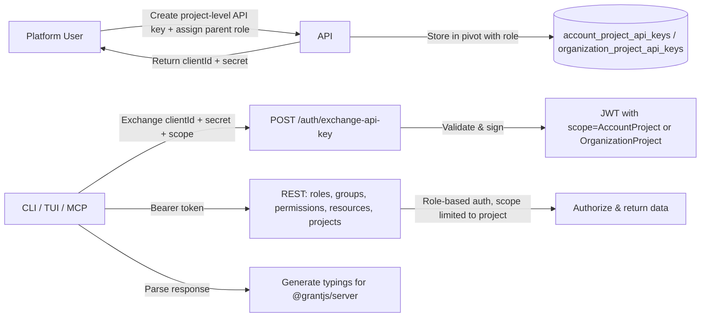

# Project-Level API Keys and CLI/TUI Typings Generation - Implementation Plan

> **Status**: Draft | **Depends on**: [ACL Engine](acl-engine.md) Phase 1–3 ✅ | [Project User API Keys](project-user-api-keys.md) ✅

## Overview

This document specifies the design and implementation of **project-level API keys** (AccountProject and OrganizationProject scopes) and their use for **CLI/TUI credential generation** and **permission model typings** for the server SDK (`@grantjs/server`). The goal is to enable developers to generate credentials that can read a project's roles, groups, permissions, and resources via the REST API—without being tied to a specific user—so that CLI tools, TUIs, and (later) MCP servers can generate TypeScript typings for the permission model in a deterministic way, with optional LLM assistance in a later phase.

**Related plans**:

- [ACL Engine](acl-engine.md) – Phase 4 (CLI) and server SDK typings context.
- [Project User API Keys](project-user-api-keys.md) – Current API key lifecycle and pivot pattern; this plan extends scope to project-level tenants.

**Note on roadmap**: The ACL engine roadmap (Phase 4) includes a CLI tool for authentication, account/project selection, and API key management. This plan focuses on (1) extending API keys to project-level tenants so that (2) CLI/TUI/MCP can call the REST API to read the project's permission model and (3) generate typings for better integration with `@grantjs/server`.

## Problem Statement

### Current State

1. **API keys are user-scoped only**
   - API keys are created and exchanged only for **AccountProjectUser**, **OrganizationProjectUser**, and **ProjectUser** tenants (see [api-keys.handler.ts](../../apps/api/src/handlers/api-keys.handler.ts), [api-keys.service.ts](../../apps/api/src/services/api-keys.service.ts)).
   - Creation and exchange require a **user identity** (projectId + userId); the token `sub` claim is set to that userId, and authorization uses the existing user → role → group → permission cascade.
   - **AccountProject** and **OrganizationProject** are explicitly rejected in both `createApiKey` and `exchangeApiKeyForToken` (handler throws for unsupported tenant; exchange throws "not yet implemented" for AccountProject/OrganizationProject).

2. **CLI/TUI and MCP need project-scoped access**
   - The next roadmap goal is a **CLI/TUI** to generate **typings for the permission model** (resources, actions, roles, groups) for better integration with `@grantjs/server`.
   - Typings generation requires reading, via the REST API:
     - Project details
     - Roles (and optionally groups, permissions)
     - Groups
     - Permissions
     - Resources (slugs, actions)
   - These operations are scoped to a **project** (AccountProject or OrganizationProject). Binding credentials to a **user** in that project is unnecessary and awkward for tooling: the CLI/TUI (or MCP) acts on behalf of “the project” for read-only model introspection, not on behalf of a specific user.
   - **MCP** (Model Context Protocol) integration may later use the same credentials so that AI assistants can call the Grant REST API (e.g. list roles, permissions, resources) for a project. Starting with deterministic typings generation keeps the scope clear; LLM-assisted flows can be added later.

3. **No way to obtain project-level credentials today**
   - There is no pivot table or flow to associate an API key with **AccountProject** or **OrganizationProject**.
   - Exchange and token signing assume a `userId`; project-level keys have no natural user identity.

### Requirements

- **Project-level API keys**: Support creating, storing, and exchanging API keys for **AccountProject** and **OrganizationProject** scopes (scope.id format: `accountId:projectId` or `organizationId:projectId`).
- **Authorization model for project keys**: Project API keys **impersonate a parent-tenant role** (organization role or account role) but with **effective scope limited to that single project**; see Proposed Solution.
- **CLI/TUI credentials**: Enable developers to create project-level API keys (via API or future CLI) and use them in a CLI/TUI to call the REST API for roles, groups, permissions, resources.
- **Typings generation**: Use the above data to generate TypeScript types (e.g. resource slugs, actions, role names) for use with `@grantjs/server`, in a **deterministic** way first; optional LLM/MCP assistance later.
- **Consistency with existing design**: Reuse existing API key lifecycle (create, exchange, revoke, delete), JWT shape (e.g. `scope`, `jti`), and REST/OpenAPI patterns; extend rather than replace.

## Architecture Overview

### Scope and Token Conventions (Existing)

- **AccountProject**: `scope.tenant = 'accountProject'`, `scope.id = 'accountId:projectId'`.
- **OrganizationProject**: `scope.tenant = 'organizationProject'`, `scope.id = 'organizationId:projectId'`.
- **ProjectUser / AccountProjectUser / OrganizationProjectUser**: Already supported; token `sub` = userId, authorization via user permission cascade.

### High-Level Flow (Target)

### Authorization Model: Role Impersonation with Project-Only Scope

Project-level API keys **impersonate a role defined on the parent tenant**, reusing the existing RBAC cascade, with one critical constraint: **the key's effective scope is limited to that single project**.

#### Parent-tenant roles

- **OrganizationProject** scope: The key is mapped to **one organization role** (e.g. `organizationOwner`, `organizationAdmin`, `organizationDev`, `organizationViewer`). The key operates on behalf of the **organization** in that project; its permissions come from that organization role (role → groups → permissions).
- **AccountProject** scope: The key is mapped to **one account role** (e.g. `accountOwner`). The key operates on behalf of the **account** in that project; its permissions come from that account role.

So the **scope of the roles** is the **parent tenant** (organization or account). We reuse existing organization roles and account roles; no new role types or project-specific role definitions are required.

#### Project-only scope restriction

A user with an organization role (e.g. `organizationViewer`) may have access to **multiple projects** in that organization, or to org-wide resources. A **project API key** that impersonates `organizationViewer` does **not**: its effective scope is **only the one project** it is bound to.

- **Impersonation**: The key has the same **permissions** as a user with that parent-tenant role (same role → groups → permissions cascade).
- **Restriction**: Every authorization check for that key is evaluated **as if the scope were only that project**. The key cannot access other projects in the org/account, nor parent-tenant resources outside that project, even if the role would allow it for a human user.

So: **project API keys impersonate a role on the parent scope, but only for that project.**

#### Implementation implications

- **Grant repository**: When the subject is a project API key (identified by `jti` = apiKeyId and scope.tenant in [AccountProject, OrganizationProject]), resolve the key's assigned role from the pivot (organization_role_id or account_role_id). Then run the **existing** permission cascade for that role (role → groups → permissions). When evaluating scope for that key, **always restrict** to the key's project: e.g. only return data for that project, and only allow operations where the request scope matches the key's scope (no elevating to other projects or to the full org/account).
- **Token `sub`**: Can be set to a sentinel (e.g. apiKeyId) for auditing; the authorization path uses `jti` + scope to look up the key and its assigned role, then evaluates permissions with project-only scope.

---

## Proposed Solution

### 1. Data Model: Pivot Tables for Project-Level API Keys and Role Assignment

Introduce two new pivot tables (mirroring the pattern of `project_user_api_keys`) that also store **which parent-tenant role the key impersonates**:

- **account_project_api_keys**
  - Columns: `id`, `api_key_id` (FK → api_keys), `account_project_id` (FK → account_projects), **`account_role_id`** (FK → roles, via account_roles), `created_at`, `updated_at`, `deleted_at`.
  - Unique constraint on `(api_key_id, account_project_id)` where `deleted_at IS NULL`.
  - Links an API key to an **AccountProject** and to **one account role** (e.g. accountOwner). The key impersonates that role **only for that project**.

- **organization_project_api_keys**
  - Columns: `id`, `api_key_id` (FK → api_keys), `organization_project_id` (FK → organization_projects), **`organization_role_id`** (FK → roles, via organization_roles), `created_at`, `updated_at`, `deleted_at`.
  - Unique constraint on `(api_key_id, organization_project_id)` where `deleted_at IS NULL`.
  - Links an API key to an **OrganizationProject** and to **one organization role** (e.g. organizationOwner, organizationAdmin, organizationDev, organizationViewer). The key impersonates that role **only for that project**.

Scope.id for API key creation and exchange:

- **AccountProject**: `scope.id = accountId + ':' + projectId`. Resolve to `account_projects.id` via (accountId, projectId).
- **OrganizationProject**: `scope.id = organizationId + ':' + projectId`. Resolve to `organization_projects.id` via (organizationId, projectId).

### 2. API Key Creation

- **Input**: Creation must accept **which parent-tenant role** the key impersonates: for AccountProject an **account_role_id** (e.g. accountOwner); for OrganizationProject an **organization_role_id** (e.g. organizationViewer, organizationAdmin). The role must exist and be assigned to that account/org.
- **Handler** (`api-keys.handler.ts`): In `createApiKey`, extend the `switch (scope.tenant)` to handle:
  - `Tenant.AccountProject`: Resolve (accountId, projectId) from scope.id; validate `account_projects.id` and that the given **account_role_id** is an account role for that account; create API key; insert into `account_project_api_keys` (api_key_id, account_project_id, account_role_id).
  - `Tenant.OrganizationProject`: Resolve (organizationId, projectId) from scope.id; validate `organization_projects.id` and that the given **organization_role_id** is an organization role for that org; create API key; insert into `organization_project_api_keys` (api_key_id, organization_project_id, organization_role_id).
- **Cache**: Extend `getScopedApiKeyIds` and `addApiKeyIdToScopeCache` in `cache-handler.ts` to support AccountProject and OrganizationProject (query new pivots by account_project_id / organization_project_id) so list/revoke/delete flows work.
- **Permissions**: Only users who can create API keys (e.g. ApiKey.Create in that scope) can create project-level keys; they may only assign roles they themselves can assign (e.g. org admin can assign organizationViewer, organizationAdmin, etc.).

### 3. API Key Exchange (Token Issuance)

- **api-keys.service.ts** – `exchangeApiKeyForToken`:
  - For `Tenant.AccountProject`: Parse scope.id → (accountId, projectId); resolve `account_project_id`; check `account_project_api_keys` for (apiKeyId, account_project_id); if present, issue token.
  - For `Tenant.OrganizationProject`: Parse scope.id → (organizationId, projectId); resolve `organization_project_id`; check `organization_project_api_keys` for (apiKeyId, organization_project_id); if present, issue token.
- **Token payload**: For project-level keys, set `sub` to a sentinel (e.g. apiKeyId) for auditing. The authorization layer detects project API key by “project-level API key” scope + tenant in [AccountProject, OrganizationProject] and branches to the role-impersonation path (resolve key's role from pivot, then permission cascade with project-only scope).
- **Expiration / revocation**: Unchanged (existing api_keys expiry and revoke logic).

### 4. Authorization for Project-Level Keys (Role-Based, Project-Only Scope)

- In the REST authorization layer (e.g. `authorizeRestRoute` or equivalent):
  - After resolving the request’s scope (from headers/query) and parsing the JWT:
    - If the token is an **API key token** (has `scope` claim) and `scope.tenant` is **AccountProject** or **OrganizationProject**:
      - Verify request scope matches token scope.
      - Resolve key's role from pivot (account_role_id or organization_role_id); run permission cascade for that role; enforce project-only scope (request scope must match token scope; restrict data to key's project).
      - Optionally verify that the apiKeyId (`jti`) is still valid and not revoked (if not already done earlier in the pipeline).
    - Else: continue with existing user-based authorization (session or project-user API key).
- **Detection**: When the token is an API key with scope.tenant in [AccountProject, OrganizationProject], treat as project API key. **Resolve role** from pivot (account_role_id or organization_role_id). **Permission check**: use existing cascade (role → groups → permissions) for that role. **Project-only scope restriction**: request scope must match token scope; restrict all data access to the key's project only (no other projects or parent-tenant resources). **Token `sub`**: sentinel (e.g. apiKeyId) for auditing.

### 5. CLI/TUI and Typings Generation (Deterministic)

- **Credentials**: User creates a project-level API key (via web UI or future CLI command), stores clientId + clientSecret securely (e.g. env or local config). CLI/TUI exchanges them for an access token (scope = AccountProject or OrganizationProject) and uses Bearer token on subsequent REST calls.
- **Typings generation** (deterministic):
  - CLI/TUI calls REST: GET roles, groups, permissions, resources (with scope = project). Optionally GET project by id.
  - From the response data, generate TypeScript (or JSON schema) that includes:
    - Resource slugs and actions (e.g. `ResourceSlug`, `ResourceAction` enums or union types)
    - Optionally role/group identifiers if needed for server SDK usage
  - Output: a file (e.g. `grant-types.ts` or similar) that projects can import for type-safe `@grantjs/server` usage (e.g. `isGranted(grant, { resource: ResourceSlug.Document, action: ResourceAction.Update })`).
- **Later (out of scope for this plan)**: LLM-assisted generation or MCP tools that use the same project-level credentials to read the model and suggest or refine typings; same credentials apply.

### 6. MCP and Future Work

- A **Grant MCP server** (separate implementation plan) can use project-level API keys to call the REST API (list roles, groups, permissions, resources) so that AI assistants have context. The MCP server would exchange the key for a token and call the REST API (authorized via the key's impersonated role with project-only scope). No change to this plan except to state that project-level keys are the intended credential for MCP when operating on a project’s permission model.

## Implementation Phases

### Phase 1: Project-Level API Keys (Backend)

**Goal**: Support creating, storing, and exchanging API keys for AccountProject and OrganizationProject; assign each key a parent-tenant role; authorize project-level key requests via role-based permission cascade with project-only scope restriction.

**Tasks**:

1. **Database**
   - [ ] Add migration: `account_project_api_keys` table (id, api_key_id, account_project_id, **account_role_id** FK to roles, created_at, updated_at, deleted_at) with FKs and unique partial index.
   - [ ] Add migration: `organization_project_api_keys` table (id, api_key_id, organization_project_id, **organization_role_id** FK to roles, created_at, updated_at, deleted_at) with FKs and unique partial index.
   - [ ] Drizzle schemas and relations in `@grantjs/database`.

2. **Repositories**
   - [ ] `AccountProjectApiKeysRepository` (or extend existing): add/remove/get by apiKeyId and account_project_id.
   - [ ] `OrganizationProjectApiKeysRepository`: add/remove/get by apiKeyId and organization_project_id.

3. **Services**
   - [ ] `ProjectUserApiKeyService`-style service for account_project and organization_project (or one “project scope API key” service): link API key to account_project / organization_project on create; validate on exchange.
   - [ ] **api-keys.service.ts**: In `createApiKey`, handle Tenant.AccountProject and Tenant.OrganizationProject (resolve scope.id, validate account_role_id / organization_role_id for that account/org; create key; insert pivot with role_id). In `exchangeApiKeyForToken`, handle both tenants (resolve scope, check pivot, then sign token with chosen `sub` and scope).
   - [ ] **api-keys.handler.ts**: In `createApiKey`, add cases for AccountProject and OrganizationProject; accept role id in input (account_role_id or organization_role_id). Ensure scope and role validation.

4. **Cache**
   - [ ] **cache-handler.ts**: In `getScopedApiKeyIds`, add cases for Tenant.AccountProject and Tenant.OrganizationProject (query new pivots by account_project_id / organization_project_id), and in `addApiKeyIdToScopeCache` for these tenants so list/revoke/delete flows work.

5. **Authorization (role-based, project-only scope)**
   - [ ] Grant repository (or equivalent): add code path for "subject is project API key" (identified by jti + scope): load account_role_id or organization_role_id from pivot; return that role's permissions via existing cascade (role → groups → permissions).
   - [ ] In REST authorization: when token is project API key, resolve role from pivot; run permission check for that role; **restrict** all data access and scope to the key's project only (request scope must match token scope; no access to other projects or parent-tenant resources outside that project).
   - [ ] Ensure scope from request (query/headers) is validated against token scope (no cross-tenant access).

6. **API and docs**
   - [ ] REST/GraphQL: createApiKey already accepts scope; document that scope.tenant can be `accountProject` | `organizationProject` and scope.id format. OpenAPI and examples.
   - [ ] POST /auth/exchange-api-key: document scope.tenant = accountProject | organizationProject and scope.id = accountId:projectId | organizationId:projectId.
   - [ ] **GraphQL**: The `ApiKey` type includes an optional `role: Role` field. When listing API keys in AccountProject or OrganizationProject scope, the backend enriches each key with its bound role (from the pivot table). User-scoped keys have `role: null`. The `getApiKeys` query and GetApiKeys operation can request `role { id name }` for display in the UI (e.g. project API keys table).

**Files to create/change** (indicative):

- `packages/@grantjs/database`: new schema files for `account_project_api_keys`, `organization_project_api_keys`; migration(s).
- `apps/api/src/repositories`: new repository (or extend) for account_project_api_keys, organization_project_api_keys.
- `apps/api/src/services`: new or extended service for linking project-scoped API keys; extend `api-keys.service.ts` (create + exchange).
- `apps/api/src/handlers/base/cache-handler.ts`: extend `getScopedApiKeyIds`, `addApiKeyIdToScopeCache`.
- `apps/api/src/handlers/api-keys.handler.ts`: handle AccountProject, OrganizationProject in createApiKey.
- `apps/api/src/lib/authorization` and grant repository: project API key detection, role resolution from pivot, permission cascade with project-only scope restriction.
- `apps/api/src/rest/openapi/api-keys.openapi.ts` (and auth.openapi if needed): document project-level scope and exchange.

### Phase 2: CLI/TUI Credential Flow and Typings Generation (Deterministic)

**Goal**: Enable developers to create and use project-level API keys from a CLI/TUI and generate typings from the project’s roles, groups, permissions, resources.

**Tasks**:

1. **Credential flow**
   - [ ] Document how to create a project-level API key (API or future CLI command) and store clientId/clientSecret (env vars or config file).
   - [ ] If CLI exists: add command to “login” or “configure” using project-level API key (exchange and store token or store clientId/secret for later exchange). Prefer storing credentials in a standard location (e.g. `~/.grant/` or project-local `.grant/`) with clear docs.

2. **Typings generation (deterministic)**
   - [ ] CLI/TUI command (e.g. `grant typings` or `grant generate-types`) that:
     - Uses stored or passed project-level credentials to exchange for token (scope = AccountProject or OrganizationProject).
     - Calls REST: GET /roles, /groups, /permissions, /resources (and optionally /projects) with scope.
     - Generates a TypeScript file (or JSON) with resource slugs, actions, and optionally role/group identifiers derived from the response.
   - [ ] Output format agreed with `@grantjs/server` usage (e.g. enums or const objects for ResourceSlug, ResourceAction).
   - [ ] Option to specify output path and project scope (accountId:projectId or organizationId:projectId).

3. **Integration with @grantjs/server**
   - [ ] Document how to use the generated typings with `isGranted()` and other server SDK APIs (e.g. type-safe resource/action strings).
   - [ ] Optional: add a small runtime in `@grantjs/server` that can load generated manifest (e.g. resources + actions) for validation or docs.

**Files to create/change** (indicative):

- `packages/@grantjs/cli` (or equivalent): commands for configure/login (project-level key), generate-types/typings; client to call REST and generate files.
- Docs: implementation-plans or getting-started for “Generating permission model typings”.

### Phase 3 (Future): MCP and LLM-Assisted Typings

- **MCP server**: Use project-level API keys to call the REST API (role-based auth, project-only scope) so that MCP tools can list roles, groups, permissions, resources for a project. Separate implementation plan (e.g. “Grant MCP server”).
- **LLM-assisted typings**: Optional enhancements to the CLI (e.g. suggest resource names, descriptions, or condition patterns) using the same REST data; can be layered on top of deterministic generation.

## Security Considerations

- **Least privilege**: Project-level keys have the permissions of their assigned parent-tenant role, but **only within that project**. The project-only scope restriction prevents access to other projects or parent-tenant resources even if the role would allow it for a user. Assign lower-privilege roles (e.g. organizationViewer) for read-only tooling.
- **Scope isolation**: Request scope (scopeId, tenant) must exactly match the token scope; reject cross-project or cross-tenant access.
- **Secret storage**: CLI/TUI and MCP must store clientSecret securely (e.g. env, keychain, or encrypted config); document best practices.
- **Audit**: Log creation, exchange, and use of project-level API keys (existing audit trails where applicable); token `sub` or `jti` can be used to correlate.

## Dependencies and References

- [ACL Engine](acl-engine.md): Phase 1–3 (core, server SDK, client SDK) and Phase 4 (CLI) context; project-level keys unblock CLI typings and MCP.
- [Project User API Keys](project-user-api-keys.md): Same API key lifecycle (create, exchange, revoke), JWT shape, and pivot pattern; project-level keys extend scope to AccountProject/OrganizationProject.
- **Existing code**: `apps/api/src/handlers/api-keys.handler.ts`, `apps/api/src/services/api-keys.service.ts`, `apps/api/src/handlers/base/cache-handler.ts`, `packages/@grantjs/database` schemas for api_keys and project_user_api_keys.

## Open Questions

1. **Token `sub` for project-level keys**: Standardize on a sentinel (e.g. apiKeyId) for auditing and logging.
2. **Multiple roles per key**: Whether to allow assigning more than one parent-tenant role to a single project API key (e.g. organizationViewer + organizationDev); current design is one role per key.
3. **CLI package name and location**: Implement typings generation in `@grantjs/cli` vs. a separate `@grantjs/typings-cli` or script in docs.

## Summary

- **Project-level API keys** (AccountProject, OrganizationProject) require new pivot tables **with parent-tenant role assignment** (account_role_id / organization_role_id), creation/exchange logic, and **role-based authorization with project-only scope restriction**: keys impersonate a role on the parent scope but only for that project.
- **CLI/TUI** can then use these keys to call the REST API and generate **deterministic typings** for the permission model (resources, actions, optionally roles/groups) for use with `@grantjs/server`.
- **MCP** and LLM-assisted flows can reuse the same credentials in a later phase. This plan focuses on backend support and deterministic typings as the next step.
