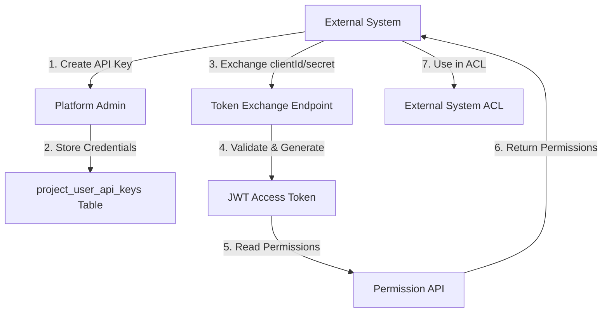

# Project User API Keys - Implementation Plan

## Overview

This document specifies the design and implementation of an authentication flow for external project users (project_user) that enables external systems to authenticate and authorize requests without requiring users to register accounts in the platform. This system provides API key credentials similar to OAuth 2.0 service accounts, but specifically designed for external systems to proxy authentication and authorization requests to the Grant Platform.

## Problem Statement

The Grant Platform currently supports two types of users:

1. **Platform Users** (`account_user`/`organization_user`)
   - Have `user_authentication_methods` (email/password, OAuth providers)
   - Manage organizations, projects, users, roles, groups, permissions
   - Authenticate through the standard login flow

2. **External Users** (`project_user`)
   - Represented in `project_users` table
   - Currently have no authentication mechanism
   - Need to authenticate external systems that will proxy ACL requests

**Requirements:**

- External systems need credentials (clientId/secret) to authenticate
- Credentials should be bound to a specific project and user combination
- Credentials should be revocable and have expiration dates
- Credentials should NOT be reusable across accounts/organizations
- External systems use credentials to obtain access tokens
- Access tokens allow reading user permissions for the project
- Tokens enable external systems to authorize/forbid requests in their ACL middleware

## Current Architecture Analysis

### Database Schema

**Existing Tables:**

- `users` - Core user entity
- `project_users` - Links users to projects (pivot table)
- `user_authentication_methods` - Authentication for platform users
- `user_sessions` - JWT sessions for platform users
- `project_roles` - Roles available in projects
- `user_roles` - User role assignments
- `project_permissions` - Permissions available in projects
- `role_groups` - Groups assigned to roles
- `group_permissions` - Permissions in groups

**Permission Evaluation Flow:**

```
User → UserRole → Role → RoleGroup → Group → GroupPermission → Permission
```

For project-scoped permissions:

- JWT `aud` claim: API URL from `config.app.url` (e.g., `https://api.grant-platform.com`) - identifies the API endpoint (RFC 7519 standard)
- Tenant scope is determined from the operation context (e.g., `projectId` parameter) or custom claims (e.g., `scope` claim)
- User must have a role in the project
- Role must have groups
- Groups must have permissions

**Note**: The `aud` claim follows RFC 7519 and contains the API URL, not tenant identifiers. Tenant scoping (project/organization/account) is handled separately through operation context or custom JWT claims.

### Authentication Flow (Platform Users)

1. User authenticates via `user_authentication_methods` (email/password or OAuth)
2. System creates `user_sessions` entry with JWT tokens
3. JWT contains `aud` claim set to API URL from `config.app.url` (identifies the API endpoint)
4. JWT contains `iss` claim set to API URL from `config.app.url` (identifies the issuer)
5. Tenant scope (account/organization/project) is determined from operation context or stored in session `audience` field
6. Subsequent requests use JWT for authorization

### Missing Components

1. **API Key Storage** - No table for project user credentials
2. **Token Exchange Endpoint** - No endpoint to exchange API keys for tokens
3. **External User Token Generation** - No mechanism to generate tokens for external users
4. **Permission Reading API** - No dedicated endpoint for external systems to read permissions

## Proposed Solution

### Architecture Overview



### Database Schema

#### New Table: `project_user_api_keys`

```sql
CREATE TABLE "project_user_api_keys" (
  "id" uuid PRIMARY KEY DEFAULT gen_random_uuid() NOT NULL,
  "project_id" uuid NOT NULL REFERENCES projects(id) ON DELETE CASCADE,
  "user_id" uuid NOT NULL REFERENCES users(id) ON DELETE CASCADE,
  "client_id" varchar(255) NOT NULL UNIQUE,
  "client_secret_hash" varchar(255) NOT NULL,
  "name" varchar(255), -- Optional human-readable name
  "description" varchar(1000), -- Optional description
  "expires_at" timestamp, -- Optional expiration
  "last_used_at" timestamp, -- Track usage
  "is_revoked" boolean DEFAULT false NOT NULL,
  "revoked_at" timestamp,
  "revoked_by" uuid REFERENCES users(id),
  "created_by" uuid REFERENCES users(id) NOT NULL,
  "created_at" timestamp DEFAULT now() NOT NULL,
  "updated_at" timestamp DEFAULT now() NOT NULL,
  "deleted_at" timestamp,
  CONSTRAINT "project_user_api_keys_project_user_unique"
    UNIQUE("project_id", "user_id")
    WHERE deleted_at IS NULL AND is_revoked = false
);

CREATE INDEX "project_user_api_keys_client_id_idx" ON "project_user_api_keys"("client_id");
CREATE INDEX "project_user_api_keys_project_id_idx" ON "project_user_api_keys"("project_id");
CREATE INDEX "project_user_api_keys_user_id_idx" ON "project_user_api_keys"("user_id");
CREATE INDEX "project_user_api_keys_deleted_at_idx" ON "project_user_api_keys"("deleted_at");
CREATE INDEX "project_user_api_keys_is_revoked_idx" ON "project_user_api_keys"("is_revoked");
```

**Key Design Decisions:**

- **Unique Constraint**: One active API key per project-user combination (prevents multiple keys)
- **Soft Delete**: Support soft deletion for audit trail
- **Revocation**: Separate `is_revoked` flag for immediate revocation without deletion
- **Expiration**: Optional `expires_at` for time-limited keys
- **Secret Hashing**: Store hashed `client_secret` (similar to password hashing)
- **Usage Tracking**: `last_used_at` for monitoring

#### Audit Log Table: `project_user_api_key_audit_logs`

```sql
CREATE TABLE "project_user_api_key_audit_logs" (
  "id" uuid PRIMARY KEY DEFAULT gen_random_uuid() NOT NULL,
  "project_user_api_key_id" uuid NOT NULL REFERENCES project_user_api_keys(id),
  "action" varchar(50) NOT NULL,
  "old_values" varchar(1000),
  "new_values" varchar(1000),
  "metadata" varchar(1000),
  "performed_by" uuid NOT NULL REFERENCES users(id),
  "created_at" timestamp DEFAULT now() NOT NULL
);

CREATE INDEX "project_user_api_key_audit_logs_key_id_idx"
  ON "project_user_api_key_audit_logs"("project_user_api_key_id");
CREATE INDEX "project_user_api_key_audit_logs_action_idx"
  ON "project_user_api_key_audit_logs"("action");
```

### Authentication Flow

#### 1. API Key Creation

**Actor**: Platform admin (organization/account user)

**Process:**

1. Admin selects a project and user (project_user)
2. System generates:
   - `clientId`: UUID-based identifier (e.g., `pk_live_...` or `pk_test_...`)
   - `clientSecret`: Cryptographically secure random string (shown once)
3. Store hashed secret in database
4. Return credentials to admin (secret shown only once)

**GraphQL Mutation:**

```graphql
mutation CreateProjectUserApiKey($input: CreateProjectUserApiKeyInput!) {
  createProjectUserApiKey(input: $input) {
    id
    clientId
    clientSecret # Only returned on creation
    name
    description
    expiresAt
    createdAt
    project {
      id
      name
    }
    user {
      id
      name
    }
  }
}

input CreateProjectUserApiKeyInput {
  projectId: ID!
  userId: ID!
  name: String
  description: String
  expiresAt: Date
}
```

**REST Endpoint:**

```
POST /api/projects/:projectId/users/:userId/api-keys
```

#### 2. Token Exchange

**Actor**: External system

**Process:**

1. External system sends `clientId` and `clientSecret`
2. System validates:
   - Key exists and is not revoked
   - Key is not expired
   - Secret matches (hash comparison)
   - Project and user are still active
3. Generate JWT access token with:
   - `sub`: user ID
   - `aud`: API base URL from `config.app.url` (configured via `APP_URL` env var, e.g., `https://api.grant-platform.com`) - identifies the intended recipient API endpoint (RFC 7519 standard)
   - `iss`: API base URL from `config.app.url` (configured via `APP_URL` env var, e.g., `https://api.grant-platform.com`) - identifies the issuer (RFC 7519 standard)
   - `exp`: Token expiration (configurable, e.g., 1 hour)
   - `iat`: Issued at timestamp

- `jti`: API key ID (JWT ID for revocation tracking)
- `scope`: `project:{project-id}` (tenant scope for permission evaluation - custom claim)

4. Return access token (no refresh token for API keys)

**Note**: The `aud` and `iss` claims are automatically set from `config.app.url` (configured via `APP_URL` environment variable, defaults to `http://localhost:4000`). This ensures consistency with regular user sessions and allows both REST (`/api`) and GraphQL (`/graphql`) endpoints to validate the same token. The same URL is used for both claims since the API is self-contained (both issues and validates tokens).

**REST Endpoint:**

```
POST /api/auth/project-user/token
Content-Type: application/json

{
  "clientId": "a1b2c3d4-e5f6-7890-abcd-ef1234567890",
  "clientSecret": "a1b2c3d4e5f6g7h8i9j0k1l2m3n4o5p6q7r8s9t0u1v2w3x4y5z6"
}
```

**Response:**

```json
{
  "success": true,
  "data": {
    "accessToken": "eyJhbGciOiJIUzI1NiIsInR5cCI6IkpXVCJ9...",
    "expiresIn": 3600,
    "tokenType": "Bearer"
  }
}
```

**GraphQL Mutation (Alternative):**

```graphql
mutation ExchangeProjectUserApiKey($input: ExchangeProjectUserApiKeyInput!) {
  exchangeProjectUserApiKey(input: $input) {
    accessToken
    expiresIn
    tokenType
  }
}

input ExchangeProjectUserApiKeyInput {
  clientId: String!
  clientSecret: String!
}
```

#### 3. Permission Reading

**Actor**: External system (with access token)

**Process:**

1. External system includes access token in `Authorization: Bearer {token}` header
2. System validates token:
   - Token signature valid
   - Token not expired
   - API key not revoked
   - Project and user still active
3. Extract `sub` (userId) and `aud` (projectId) from token
4. Query user's permissions for the project:
   - Get user's roles in project
   - Get groups for each role
   - Get permissions for each group
   - Return flattened permission list
5. Return permissions in structured format

**REST Endpoint:**

```
GET /api/projects/:projectId/users/:userId/permissions
Authorization: Bearer {accessToken}
```

**Response:**

```json
{
  "success": true,
  "data": {
    "userId": "user-123",
    "projectId": "project-456",
    "permissions": [
      {
        "id": "perm-1",
        "resource": "user",
        "action": "read",
        "scope": "project"
      },
      {
        "id": "perm-2",
        "resource": "role",
        "action": "read",
        "scope": "project"
      }
    ],
    "roles": [
      {
        "id": "role-1",
        "name": "viewer",
        "groups": ["group-1", "group-2"]
      }
    ]
  }
}
```

**GraphQL Query:**

```graphql
query GetProjectUserPermissions($projectId: ID!, $userId: ID!) {
  projectUserPermissions(projectId: $projectId, userId: $userId) {
    userId
    projectId
    permissions {
      id
      resource
      action
      scope
    }
    roles {
      id
      name
      groups {
        id
        name
      }
    }
  }
}
```

#### 4. API Key Management

**Revocation:**

```graphql
mutation RevokeProjectUserApiKey($input: RevokeProjectUserApiKeyInput!) {
  revokeProjectUserApiKey(input: $input) {
    id
    isRevoked
    revokedAt
  }
}
```

**List API Keys:**

```graphql
query GetProjectUserApiKeys($projectId: ID!, $userId: ID!) {
  projectUserApiKeys(projectId: $projectId, userId: $userId) {
    id
    clientId
    name
    description
    expiresAt
    lastUsedAt
    isRevoked
    createdAt
  }
}
```

**Delete API Key:**

```graphql
mutation DeleteProjectUserApiKey($input: DeleteProjectUserApiKeyInput!) {
  deleteProjectUserApiKey(input: $input) {
    id
    deletedAt
  }
}
```

### Security Considerations

#### 1. Secret Storage

- Use bcrypt or Argon2 for hashing `client_secret`
- Never return `client_secret` after initial creation
- Store secrets with high cost factor (similar to password hashing)

#### 2. Token Security

- Short-lived access tokens (default: 1 hour)
- No refresh tokens for API keys (require re-authentication)
- Include `api_key_id` in token for immediate revocation
- Validate API key status on every token validation

#### 3. Rate Limiting

- Implement rate limiting on token exchange endpoint
- Track failed authentication attempts
- Implement exponential backoff for repeated failures

#### 4. Audit Trail

- Log all API key operations (create, revoke, delete)
- Log token exchange attempts (success and failure)
- Log permission read requests
- Track `last_used_at` for monitoring

#### 5. Key Rotation

- Support key rotation (create new, revoke old)
- Grace period for key rotation (allow both keys temporarily)
- Clear documentation for external systems

### Implementation Phases

#### Phase 1: Database Schema & Core Models ✅

- [x] Create `project_user_api_keys` table migration
- [x] Create `project_user_api_key_audit_logs` table migration
- [x] Create Drizzle schema files
- [x] Export types from database package

**Files Created:**

- `packages/@logusgraphics/grant-database/src/schemas/project-user-api-keys.schema.ts`
- `packages/@logusgraphics/grant-database/src/migrations/0019_broken_the_hood.sql` (includes project_user_api_keys)

#### Phase 2: Repository Layer ✅

- [x] Create `ProjectUserApiKeyRepository`
- [x] Implement CRUD operations
- [x] Implement secret hashing/verification (via service layer)
- [x] Implement query methods (by clientId, by project/user, etc.)

**Files Created:**

- `apps/api/src/repositories/project-user-api-keys.repository.ts`

#### Phase 3: Service Layer ✅

- [x] Create `ProjectUserApiKeyService`
- [x] Implement key generation (clientId/secret)
- [x] Implement secret hashing
- [x] Implement validation logic
- [x] Implement audit logging
- [x] Create token generation service for API keys (integrated into service)

**Files Created:**

- `apps/api/src/services/project-user-api-keys.service.ts`
- `apps/api/src/services/project-user-api-keys.schemas.ts`

#### Phase 4: GraphQL Schema & Handlers ✅

- [x] Add GraphQL types and inputs
- [x] Create `ProjectUserApiKeyHandler`
- [x] Implement mutations (create, revoke, delete)
- [x] Implement queries (list with pagination)
- [x] Implement token exchange mutation
- [ ] Implement permission reading query (Phase 7)

**Files Created:**

- `packages/@logusgraphics/grant-schema/src/schema/project-user-api-keys/types/*.graphql`
- `packages/@logusgraphics/grant-schema/src/schema/project-user-api-keys/inputs/*.graphql`
- `packages/@logusgraphics/grant-schema/src/schema/project-user-api-keys/mutations/*.graphql`
- `packages/@logusgraphics/grant-schema/src/schema/project-user-api-keys/queries/*.graphql`
- `apps/api/src/handlers/project-user-api-keys.handler.ts`
- `apps/api/src/graphql/resolvers/project-user-api-keys/**/*.ts`

#### Phase 5: REST API ✅

- [x] Create REST routes
- [x] Create REST controllers
- [x] Create request/response schemas
- [x] Add OpenAPI documentation

**Files Created:**

- `apps/api/src/rest/routes/project-user-api-keys.routes.ts`
- `apps/api/src/rest/controllers/project-user-api-keys.controller.ts`
- `apps/api/src/rest/schemas/project-user-api-keys.schemas.ts`
- `apps/api/src/rest/openapi/project-user-api-keys.openapi.ts`

#### Phase 6: Authentication Middleware

- [ ] Extend auth middleware to support API key tokens
- [ ] Add token validation for `project_user_api_key` type
- [ ] Implement permission reading endpoint authentication
- [ ] Add rate limiting

**Files to Modify:**

- `apps/api/src/middleware/auth.middleware.ts`
- `apps/api/src/lib/auth.lib.ts`

#### Phase 7: Permission Service Integration

- [ ] Create permission reading service method
- [ ] Integrate with existing permission evaluation logic
- [ ] Optimize queries for external system use
- [ ] Add caching for permission reads
- [ ] Implement permission reading GraphQL query

**Files to Create/Modify:**

- `apps/api/src/services/project-user-permissions.service.ts` (or extend existing)

#### Phase 8: Testing

- [ ] Unit tests for repositories
- [ ] Unit tests for services
- [ ] Integration tests for token exchange
- [ ] Integration tests for permission reading
- [ ] Security tests (revocation, expiration, etc.)

#### Phase 9: Documentation

- [ ] API documentation
- [ ] Integration guide for external systems
- [ ] Security best practices
- [ ] Example code snippets

#### Phase 10: Web Integration (Frontend)

- [ ] Create React hooks for API key management
  - [ ] `useProjectUserApiKeys` - List and manage API keys
  - [ ] `useCreateProjectUserApiKey` - Create new API key
  - [ ] `useRevokeProjectUserApiKey` - Revoke API key
  - [ ] `useDeleteProjectUserApiKey` - Delete API key
  - [ ] `useExchangeProjectUserApiKey` - Exchange credentials for token (for testing)
- [ ] Create API key management components
  - [ ] `ProjectUserApiKeyList` - Display list of API keys with pagination
  - [ ] `ProjectUserApiKeyForm` - Create/edit API key form
  - [ ] `ProjectUserApiKeyCard` - Individual API key card with actions
  - [ ] `CreateApiKeyModal` - Modal for creating new API key (with secret display)
  - [ ] `RevokeApiKeyConfirmDialog` - Confirmation dialog for revocation
  - [ ] `DeleteApiKeyConfirmDialog` - Confirmation dialog for deletion
- [ ] Add navigation and routing
  - [ ] Add API keys section to project settings
  - [ ] Add API keys section to user management
  - [ ] Create dedicated API keys page/route
- [ ] Implement UI features
  - [ ] Secret visibility toggle (show/hide)
  - [ ] Copy to clipboard functionality
  - [ ] Expiration date display and warnings
  - [ ] Last used timestamp display
  - [ ] Revoked status indicators
  - [ ] Empty state for no API keys
  - [ ] Loading states and error handling
- [ ] Add permissions checks
  - [ ] Verify user has permission to manage API keys
  - [ ] Show/hide actions based on permissions
  - [ ] Display appropriate error messages

**Files to Create:**

- `apps/web/src/hooks/project-user-api-keys/use-project-user-api-keys.ts`
- `apps/web/src/hooks/project-user-api-keys/use-create-project-user-api-key.ts`
- `apps/web/src/hooks/project-user-api-keys/use-revoke-project-user-api-key.ts`
- `apps/web/src/hooks/project-user-api-keys/use-delete-project-user-api-key.ts`
- `apps/web/src/components/project-user-api-keys/project-user-api-key-list.tsx`
- `apps/web/src/components/project-user-api-keys/project-user-api-key-form.tsx`
- `apps/web/src/components/project-user-api-keys/project-user-api-key-card.tsx`
- `apps/web/src/components/project-user-api-keys/create-api-key-modal.tsx`
- `apps/web/src/components/project-user-api-keys/revoke-api-key-confirm-dialog.tsx`
- `apps/web/src/components/project-user-api-keys/delete-api-key-confirm-dialog.tsx`

### API Key Format

**Client ID Format:**

```
{random_uuid}
```

Examples:

- `a1b2c3d4-e5f6-7890-abcd-ef1234567890`
- `b2c3d4e5-f6a7-8901-bcde-f12345678901`

**Client Secret Format:**

```
{random_base64}
```

Examples:

- `a1b2c3d4e5f6g7h8i9j0k1l2m3n4o5p6q7r8s9t0u1v2w3x4y5z6`
- `b2c3d4e5f6g7h8i9j0k1l2m3n4o5p6q7r8s9t0u1v2w3x4y5z6a7`

**Rationale:**

- UUID for client ID ensures uniqueness and is easily identifiable
- Base64 random string for client secret provides high entropy
- No prefixes to avoid exposing implementation details
- Simple format that's easy to work with programmatically

### Token Claims

**JWT Structure:**

```json
{
  "sub": "user-uuid",
  "aud": "https://api.grant-platform.com",
  "iss": "https://api.grant-platform.com",
  "exp": 1234567890,
  "iat": 1234564290,
  "jti": "api-key-uuid",
  "scope": "project:project-uuid"
}
```

**Claim Explanations:**

- `sub` (Subject): User ID - identifies the user
- `aud` (Audience): API URL from `config.app.url` (configured via `APP_URL` env var) - identifies the intended recipient API endpoint (e.g., `https://api.grant-platform.com`)
- `iss` (Issuer): API URL from `config.app.url` (configured via `APP_URL` env var) - identifies who issued the token (same as audience for self-contained APIs)
- `exp` (Expiration): Token expiration timestamp
- `iat` (Issued At): Token issuance timestamp
- `jti` (JWT ID): API key ID - unique identifier for this token (used for revocation tracking and identifying the source API key)
- `scope`: Custom claim - tenant scope in format `project:{project-id}` for permission evaluation

**Key Differences from Regular Sessions:**

- `aud`: Uses API URL from `config.app.url` (same as regular sessions)
- `iss`: Uses API URL from `config.app.url` (same as regular sessions - both use `config.app.url`)
- `scope`: Explicit tenant scope claim in format `project:{project-id}` (vs parsing from operation context in regular sessions)
- `jti`: Contains API key ID (vs session ID in regular sessions)
- No `session_id` (API keys don't create sessions)
- Shorter expiration (1 hour vs 7 days for sessions)
- Simplified claims: removed redundant `type`, `api_key_id`, `project_id`, and `user_id` claims as `sub`, `jti`, and `scope` provide sufficient information

**Configuration:**

- Both `aud` and `iss` are automatically set from `config.app.url`
- `config.app.url` is configured via `APP_URL` environment variable
- Default value: `http://localhost:4000`
- The same URL is used for both `aud` and `iss` claims (self-contained API pattern)
- The same URL is used for both REST (`/api`) and GraphQL (`/graphql`) endpoints, allowing tokens to be validated by either

**Note on Audience vs Scope:**

- `aud` (audience) follows RFC 7519 standard: identifies the API endpoint that should accept the token (URL format)
- `scope` (custom claim) identifies the tenant context for permission evaluation (`project:{project-id}` format)
- This separation allows the token to be validated for the correct API while also identifying the tenant scope

### Error Handling

**Token Exchange Errors:**

- `INVALID_CREDENTIALS` - Client ID or secret incorrect
- `API_KEY_REVOKED` - API key has been revoked
- `API_KEY_EXPIRED` - API key has expired
- `PROJECT_NOT_FOUND` - Project doesn't exist or is deleted
- `USER_NOT_FOUND` - User doesn't exist or is deleted
- `USER_NOT_IN_PROJECT` - User is not a member of the project

**Permission Reading Errors:**

- `INVALID_TOKEN` - Token is invalid or expired
- `API_KEY_REVOKED` - API key used to generate token has been revoked
- `TOKEN_TYPE_MISMATCH` - Token is not a project user API key token
- `PROJECT_MISMATCH` - Token project doesn't match request project
- `USER_MISMATCH` - Token user doesn't match request user

### Integration Example

**External System ACL Middleware (Pseudocode):**

```typescript
async function aclMiddleware(req, res, next) {
  // 1. Extract user identifier from request (e.g., from external system's auth)
  const externalUserId = req.user.id; // From external system

  // 2. Map external user to Grant Platform project user
  const projectUserId = await mapExternalUserToProjectUser(externalUserId);

  // 3. Exchange API key for token (cache token)
  const token = await getOrRefreshToken(projectUserId);

  // 4. Query Grant Platform for permissions
  const permissions = await grantPlatform.getPermissions({
    projectId: process.env.GRANT_PROJECT_ID,
    userId: projectUserId,
    token: token,
  });

  // 5. Check if user has required permission
  const requiredPermission = `${req.resource}:${req.action}`;
  const hasPermission = permissions.some(
    (p) => p.resource === req.resource && p.action === req.action
  );

  if (!hasPermission) {
    return res.status(403).json({ error: 'Forbidden' });
  }

  next();
}
```

### Migration Strategy

1. **Backward Compatibility**: Existing project users continue to work without API keys
2. **Gradual Rollout**: API keys are optional; external systems can adopt gradually
3. **Key Rotation**: Support creating new keys before revoking old ones
4. **Monitoring**: Track API key usage and token exchange rates

### Future Enhancements

1. **Key Scopes**: Limit API keys to specific permissions (read-only, specific resources)
2. **IP Whitelisting**: Restrict API key usage to specific IP addresses
3. **Webhook Support**: Allow API keys to trigger webhooks for permission changes
4. **Key Analytics**: Dashboard for API key usage and performance
5. **Multi-Project Keys**: Keys that work across multiple projects (with explicit project list)
6. **Key Templates**: Pre-configured key settings for common use cases

### Open Questions

1. **Token Expiration**: Should tokens be configurable per API key or global?
2. **Refresh Tokens**: Should we support refresh tokens for API keys (currently no)?
3. **Key Limits**: Should there be a limit on number of API keys per project/user?
4. **Key Naming**: Should keys require names or be optional?
5. **Environment Separation**: Should test/production keys be in separate tables or use flags?

### Dependencies

- Existing authentication infrastructure
- JWT token generation (already exists)
- Permission evaluation system (already exists)
- Audit logging system (already exists)
- Secret hashing utilities (already exists for passwords)

### Risks & Mitigations

1. **Secret Leakage**: Mitigate with secure storage, hashing, and rotation support
2. **Token Replay**: Mitigate with short expiration and revocation checks
3. **Rate Limiting**: Implement to prevent abuse
4. **Key Management**: Provide clear UI and documentation for key management
5. **Permission Caching**: Balance performance with freshness requirements

---

## Summary

This implementation plan provides a comprehensive authentication system for external project users that:

1. **Enables External Integration**: Allows external systems to authenticate without user registration
2. **Maintains Security**: Uses industry-standard practices (hashed secrets, JWT tokens, revocation)
3. **Provides Flexibility**: Supports expiration, revocation, and audit trails
4. **Integrates Seamlessly**: Works with existing permission evaluation system
5. **Scales Effectively**: Designed for high-volume permission checks from external systems

The system is similar to OAuth 2.0 service accounts but tailored specifically for the Grant Platform's project user model and permission system.
