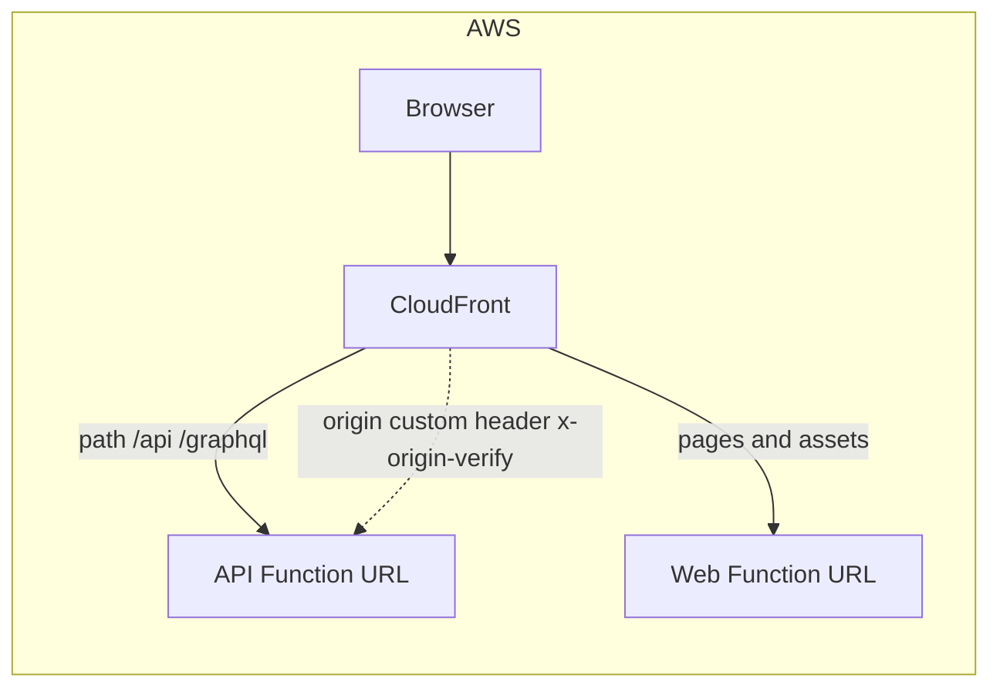
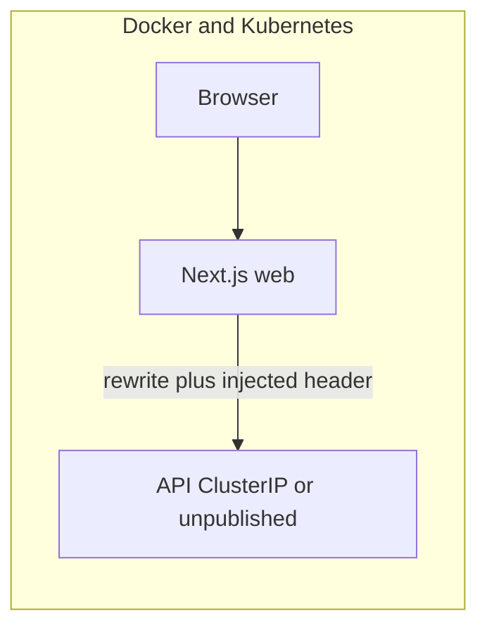

# Closed install: origin gate + disable public signup

- **Slug**: `closed-install`
- **Date**: 2026-10-07
- **Status**: approved (Gate 1 — 2026-10-07 Alejandro) / in-progress
- **Story trunk**: `feat/closed-install`
- **Stack plan**: [2026-10-07-closed-install-stack.md](./2026-10-07-closed-install-stack.md)
- **Review bar**: security-full (auth, origin secret, account deletion)

## Objective

A company can run Grant on the public internet **without a VPN**, for **their own organization(s)**: the API refuses traffic that did not come through a trusted front (CloudFront, Next, or Ingress), public platform signup is off after the first operator exists, and that last operator cannot delete themselves. Project Apps keep their own `allowSignUp` switch.

## Decisions (2026-10-07)

1. **Reuse origin-verify**, not unused `SECURITY_API_KEY`. One secret: `ORIGIN_VERIFY_SECRET`. Fail closed with `SECURITY_ORIGIN_VERIFY_REQUIRED=true`.
2. **Block** platform email/password register and GitHub/Google **new** users when public signup is off. **Keep** organization invitations. **Keep** Project App hosted sign-in creating users when that app has `allowSignUp` enabled.
3. **First operator**: platform `register` is allowed only while there is no human user (exclude the seeded system user). Then it closes.
4. **Last human user** cannot delete their account. **Follow-up story**: ownership transfer via invitation (not in this stack).

## What already exists

| Piece                                                                                                                                       | State                                                                                                                                                                                                               |
| ------------------------------------------------------------------------------------------------------------------------------------------- | ------------------------------------------------------------------------------------------------------------------------------------------------------------------------------------------------------------------- |
| `originVerifyMiddleware` in [`apps/api/src/middleware/origin-verify.middleware.ts`](../apps/api/src/middleware/origin-verify.middleware.ts) | Wired first in the API pipeline. Compares header `SECURITY_ORIGIN_VERIFY_HEADER` (default `x-origin-verify`) to `ORIGIN_VERIFY_SECRET`. **No exempt paths** on the public API.                                      |
| AWS CloudFront                                                                                                                              | Attaches the secret as an **origin custom header** on the API Function URL origin ([`deploy/aws/lib/edge/distribution.ts`](../deploy/aws/lib/edge/distribution.ts) `customHeaders`). **Not** a CloudFront Function. |
| `SECURITY_ORIGIN_VERIFY_REQUIRED`                                                                                                           | Fail-closed when the secret is missing. AWS sets `true`. Docker/K8s default `false` (pass-through).                                                                                                                 |
| `SECURITY_API_KEY`                                                                                                                          | In env schema / `SECURITY_CONFIG.apiKey` only. **No runtime consumer.** Leave it unwired; do not create a second gate.                                                                                              |
| Next.js rewrites                                                                                                                            | Proxy `/api`, `/graphql`, `/health`, `/storage` to the API. **Do not** attach the secret today.                                                                                                                     |
| Public `register`                                                                                                                           | Always on (GraphQL/REST + `/auth/register` + OAuth first-time).                                                                                                                                                     |
| System user                                                                                                                                 | Seeded `SYSTEM_USER_ID` (default `00000000-0000-0000-0000-000000000000`). Not an operator.                                                                                                                          |
| Invitations                                                                                                                                 | Can create a user on accept ([`organization-invitations.handler.ts`](../apps/api/src/handlers/organization-invitations.handler.ts)).                                                                                |
| Project App `allowSignUp`                                                                                                                   | Already gates project hosted sign-in user creation.                                                                                                                                                                 |

## How the origin secret is attached (not a CloudFront Function)

The secret must **never** go to the browser (`NEXT_PUBLIC_*` forbidden). A probe that hits the API origin without the header gets a generic 403.

**AWS / CloudFront — already implemented.** CloudFront **origin custom headers** (`FunctionUrlOrigin` `customHeaders`) add `x-origin-verify` on the hop CloudFront → API. The viewer never sees it. The existing CloudFront **Function** on the web behaviour is only trailing-slash redirect; it must not hold this secret (function code and KeyValueStore are the wrong place). Keep `SECURITY_ORIGIN_VERIFY_REQUIRED=true`.

**Docker / Compose.** Do not publish the API port to the internet when the gate is on. Publish only the web origin. Set `APP_URL` and `SECURITY_FRONTEND_URL` to that web URL so OAuth callbacks and the CLI go through Next. Next.js **server** middleware (not `next.config` rewrites — rewrites cannot add headers) injects `x-origin-verify` on proxied paths. Both web and API get `ORIGIN_VERIFY_SECRET` from env / secret store. Set `SECURITY_ORIGIN_VERIFY_REQUIRED=true`.

**Kubernetes.** Same trust model, two valid fronts:

1. **Preferred:** Service for API is ClusterIP only. Ingress to web. Next injects the header (same as Docker).
2. **Split Ingress:** Ingress routes `/api` and `/graphql` to the API Service and adds the request header (nginx `proxy_set_header`, Traefik custom request headers, Gateway API header modifier). Then Next does not need the secret. OAuth callback URLs still use the public Ingress host.

Direct `curl` / CLI against the **API Service URL** must send the header. Direct `curl` against the **web origin** does not — the front attaches it.

Jobs event-dispatch stays mounted **ahead** of origin-verify and **only** on the jobs Lambda (no Function URL). Do not copy that exemption onto the public API.

## Signup policy

New env (name in implementation; default keeps today’s open SaaS behaviour):

- `AUTH_PUBLIC_SIGNUP_ENABLED` — default `true`. Company closed install sets `false`.

When `false`:

| Path                                | Behaviour                                                                                                              |
| ----------------------------------- | ---------------------------------------------------------------------------------------------------------------------- |
| Platform email/password `register`  | Allowed **only** if human user count is 0 (exclude system user). After that: 403/`Forbidden` with a stable error code. |
| Platform GitHub/Google **new** user | Same as register. Existing users still log in / link.                                                                  |
| Org / account invitation accept     | **Allowed** (creates the invited user if needed).                                                                      |
| Project App hosted sign-in          | Unchanged: create user when `allowSignUp` is true.                                                                     |
| `/auth/register` UI                 | Hidden unless bootstrap is open (no human users yet) or the visitor has an invitation token.                           |
| Last non-system user delete         | `deleteUser` / privacy delete-my-accounts **refused**.                                                                 |

Expose bootstrap + public-signup flags on the existing public auth surface (e.g. `GET /api/auth/providers`) so the web can hide register without a circular call that needs a session.

## Non-goals (this story)

- Wiring or removing `SECURITY_API_KEY`
- VPN, split DNS, IP allowlists, mTLS
- Disabling Project App signup globally
- Ownership transfer / “invite a new owner then leave” (follow-up)
- Putting the origin secret in a CloudFront Function

## Follow-up (separate brief later)

**Ownership transfer via invitation.** Last owner cannot delete until they invite another human, the invitee accepts, and ownership/roles move. This story only **blocks** last-user delete so a closed install cannot wipe the only operator.

## Risk flags

- Auth / sessions
- Origin shared secret
- GDPR deletion (last-user refusal)

## Acceptance criteria

- [ ] With `ORIGIN_VERIFY_SECRET` unset and `SECURITY_ORIGIN_VERIFY_REQUIRED=false`, local/dev behaviour is unchanged.
- [ ] With secret set and required, a request to the API without the header is 403; the same request through web rewrite or CloudFront origin custom header succeeds.
- [ ] The secret never appears in browser JS or `NEXT_PUBLIC_*`.
- [ ] AWS path still uses origin **custom headers**, not a CloudFront Function.
- [ ] `AUTH_PUBLIC_SIGNUP_ENABLED=false`: first human can register; second platform self-signup and OAuth-new-user fail; invitations still work; Project App `allowSignUp` still works.
- [ ] Last human user cannot delete their account.
- [ ] Config app + `docs/getting-started/configuration.md` + Docker/K8s/AWS deploy notes describe the three fronts.
- [ ] Docs state `SECURITY_API_KEY` is unused (not the origin gate).

## Human gate

- [x] Gate 1: Story brief approved — 2026-10-07 Alejandro
